# 簡易POSアプリ（Lv1＋Lv2）設計仕様書（基本設計書）

| 項目 | 内容 |
|---|---|
| 文書名 | 簡易POSアプリ（Lv1＋Lv2）設計仕様書（基本設計書） |
| 版 | 第1版（ドラフト） |
| 対象要件定義書 | 07_要件定義書.md（本リポジトリ、第1版） |
| 対象要求仕様書 | Lv1（簡易POSアプリ初級編）要求一覧、Lv2（簡易POSアプリ改）要求一覧 |

**記法ルールについて**: 本書は要件定義書と同じ記法ルールを踏襲する。`[AI提案]` は要件定義書・要求仕様書に根拠がなく設計者（AI）が提案した内容、`[要確認]` は要件定義書の時点で未確定・要確認とされていた事項がそのまま設計に持ち越されている箇所を示す。タグのない記述は、要件定義書の確定要件（BR/FR/SCR/DR/IF/NFR/CON/ASM）を設計として具体化したものである。

---

## 1. はじめに

| 項目 | 内容 |
|---|---|
| 文書名 | 簡易POSアプリ（Lv1＋Lv2）設計仕様書（基本設計書） |
| 版 | 第1版（ドラフト） |
| 対象要件定義書 | `output/requirements-definition/07_要件定義書.md`（第1版） |
| 対象要求仕様書 | Lv1（簡易POSアプリ初級編）要求一覧、Lv2（簡易POSアプリ改）要求一覧 |
| 参考資料 | `input/ネットワークセキュリティ.pdf`（Tech0提供） |

**記法ルールについて**: 本書は要件定義書と同じ記法ルールを踏襲する。`[AI提案]` は要件定義書・要求仕様書に根拠がなく設計者（AI）が提案した内容、`[要確認]` は要件定義書の時点で未確定・要確認とされていた事項がそのまま設計に持ち越されている箇所を示す。タグのない記述は、要件定義書の確定要件（BR/FR/SCR/DR/IF/NFR/CON/ASM）を設計として具体化したものである。

---

### 1.1 目的

本書は、`07_要件定義書.md` に整理された業務要件・機能要件・画面要件・データ要件・外部インターフェース要件・非機能要件・制約事項を出発点とし、これをソフトウェアとして実装可能な設計に落とし込むことを目的とする。

要件定義書自体が「現時点で確認できている要求・要件を整理したものであり、記載されている全項目の仕様が最終決定していることを意味しない」という位置づけであったのと同様に、本書も「要件定義書の時点で未確定だった事項を、設計者が独断で確定させるものではない」という前提に立つ。要件定義書で `[要確認]` とされていた事項は、原則として本書でも未確定のまま扱い、設計上どうしても具体化が必要な箇所のみ `[AI提案]` として暫定案を示す。

### 1.2 対象読者

- 本システムの開発を担当するエンジニア（フロントエンド／バックエンド／インフラ）
- 発注者側で本設計の内容を確認・承認する関係者
- 後続フェーズ（詳細設計・実装・テスト）を担当する開発チームメンバー

### 1.3 用語定義

| 用語 | 意味 |
|---|---|
| 簡易POSアプリ | 本プロジェクトで開発対象とするWebアプリケーション（小規模スーパーのレジ業務を想定） |
| Lv1 / Lv2 | 要求仕様書の版。Lv2はLv1の要求を引き継いだ差分仕様として提示されている |
| REQ-xxx | 要求仕様書中の要求事項に付与されたID（要件定義書フェーズで採番） |
| BR/FR/SCR/DR/IF/NFR/CON/ASM | 要件定義書で用いられる要件カテゴリのIDプレフィックス（業務要件／機能要件／画面要件／データ要件／外部インターフェース要件／非機能要件／制約事項／前提条件） |
| ISS-xxx | 要件定義書で起票された「未確定事項・要確認事項」のID |
| 会員 | 会員情報が登録済みの顧客（本アプリでは会員登録機能自体は対象外として確定している。ASM-001, ISS-022参照） |
| レジ担当者 | 担当者ID・パスワードでログインし、レジ業務を行う店員 |
| 商品マスタ | 商品コード・商品名・単価等を保持するデータ（登録・編集機能は対象外として確定している。ISS-004参照） |
| BFF（Backend for Frontend） | ブラウザとバックエンド（FastAPI）の間に置くリバースプロキシ層。本書ではNext.jsのAPI Routesがこの役割を担う設計を`[AI提案]`として採用している（7.4.2節） |
| JWT（JSON Web Token） | 認証情報を含む署名付きトークン。本書では自前発行のJWTによる認証方式を`[AI提案]`として採用している（7.4.1節） |
| Authentication（認証）／Authorization（認可） | 認証＝ログインした担当者が誰であるかを確認する処理、認可＝認証済みの担当者が特定の操作を行ってよいかを判断する処理。本書では7.4.1節でこの2つを区別して設計している |
| CORS（Cross-Origin Resource Sharing） | ブラウザが実装するSame-Origin Policyを、異なるオリジン間の通信で例外的に許可するための仕組み。ブラウザが関与しないサーバー間通信には適用されない（7.4.2節） |

### 1.4 参照文書

| No | 文書名 | 位置づけ |
|---|---|---|
| 1 | Lv1_簡易POSアプリ初級編_要求一覧.docx | 要求仕様書（原本、REQ-039〜075の出典） |
| 2 | Lv2_簡易POSアプリ改_要求一覧.docx | 要求仕様書（原本、REQ-001〜038の出典） |
| 3 | 07_要件定義書.md／07_要件定義書.docx | 要件定義書（本書の直接の入力） |
| 4 | 05_トレーサビリティマトリクス.md | 要求ID→要件IDの対応表（本書3.1節のトレーサビリティの基礎資料） |
| 5 | ネットワークセキュリティ.pdf | Azureネットワーク／セキュリティ技術の参考資料（本書8章の設計提案の根拠。要求仕様書には対応するセキュリティ要件の明記がないため、本書で採用する構成は全て `[AI提案]` として扱う） |


---

## 2. システム全体構成

### 2.1 アーキテクチャ図

制約事項CON-001〜004（要件定義書12章）により、本システムはWebアプリケーションとしてNext.js（フロントエンド）・FastAPI（バックエンド）・Azure Database for MySQL Flexible Server（DB）で構成することが確定している。CON-006により、フロントエンドとバックエンドの役割分担（検索・スキャン・購入等の処理を両者で分担すること）も確定要件である。

一方、バックエンド（FastAPI）をAzure上のどのホスティングサービスで動かすかは要求仕様書上「自分たちで判断すること」とされており未確定（TBD-001）。下図ではホスティングサービス欄を `[AI提案]` として候補を例示するに留め、確定事項としない。

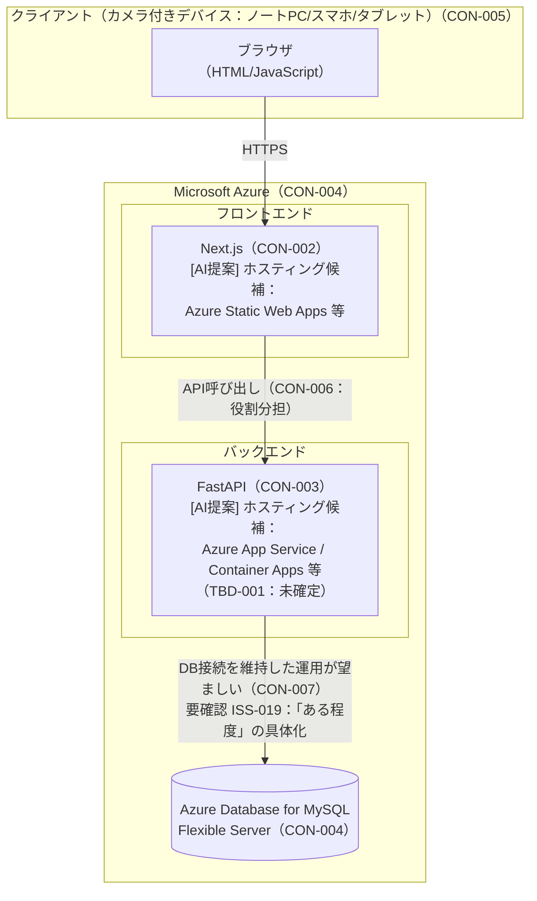

上図が示す各要素の確定・未確定の区分は次のとおりである。

- **確定**: Next.js／FastAPI／Azure Database for MySQL Flexible Serverという技術構成そのもの（CON-002〜004）、フロント・バック間の役割分担（CON-006）、DB接続をある程度維持した運用が望ましいという方針（CON-007、ただし「ある程度」の具体的基準はISS-019として未確定）
- **未確定**: バックエンドの具体的なホスティングサービス（TBD-001。開発チーム判断に委ねられている）
- **AI提案**: ホスティングサービスの候補列挙、および8章で扱うネットワーク閉域化構成（本章では概観のみ）

### 2.2 使用技術・ミドルウェア一覧

| 区分 | 技術・製品 | 出典 | 備考 |
|---|---|---|---|
| フロントエンド | Next.js | CON-002 | 確定要件 |
| バックエンド | FastAPI | CON-003 | 確定要件 |
| インフラ（クラウド） | Microsoft Azure | CON-004 | 確定要件 |
| データベース | Azure Database for MySQL Flexible Server | CON-004 | 確定要件 |
| バックエンドホスティング | 未確定（Azure App Service／Azure Container Apps 等が候補） | TBD-001, CON-004-1 | `[AI提案]` 候補例示のみ。選定は開発チーム判断 |
| 外部認証基盤 | 使用しない（自前でID・パスワードを管理） | IF-001, REQ-027, REQ-062 | 確定要件 |
| ネットワーク／セキュリティ構成 | VNet／NSG／Private Link等（詳細は8章） | ネットワークセキュリティ.pdf | `[AI提案]` 要求仕様書に根拠なし |

決済代行サービス・レシートプリンタ連携等の外部インターフェースについては、該当機能自体が対象外として確定している（ISS-003）ため、本節には記載しない。

---

### 2.3 ユースケース図（Lv3水準）

#### 2.3.1 アクター

| アクター | 種別 | 説明 |
|---|---|---|
| レジ担当者 | 主アクター（人間） | 担当者ID・パスワードでログインし、商品登録から購入確定までのレジ業務を行う（BR-001, BR-004）。会員の会員IDカードもレジ担当者がスキャンする想定であり、要求仕様書上「会員」自身がシステムを直接操作する記述はないため、会員は本ユースケース図のアクターとしない |

外部ID基盤を利用しない（IF-001）ため、外部システムをアクターとして扱う対象は存在しない。

#### 2.3.2 ユースケース一覧（事前条件・事後条件・出典）

| ID | ユースケース名 | 概要 | 事前条件 | 事後条件 | 出典要件ID | 備考 |
|---|---|---|---|---|---|---|
| UC-01 | ログインする | 担当者ID・パスワードで認証を受ける | ログイン画面を表示中。未ログイン状態 | （成功）POSアプリ画面に遷移し、以降の取引に担当者情報が紐づく／（失敗）エラー表示、画面に留まる | BR-001, FR-019, SCR-001, DR-007, IF-001 | |
| UC-02 | 商品を登録する（スキャン） | カメラでバーコードを読み取り購入リストに反映する | ログイン済みでPOSアプリ画面を表示中 | 一致商品があれば新規行追加または数量+1。認識失敗時はエラー（`[AI提案]` FR-020） | FR-001〜004, FR-022, SCR-002, DR-001 | «include» 商品マスタと照合する |
| UC-03 | 商品を登録する（手入力） | 商品コードを手入力し購入リストに反映する | 同上 | UC-02と同様の結果 | FR-005, SCR-008 | «include» 商品マスタと照合する。確定操作はEnterキー押下に確定（発注者確認済み、ISS-029解消。専用ボタンは設けない） |
| （include先）| 商品マスタと照合する | 商品コードを商品マスタと突き合わせる | 商品コードが確定している | 一致時：名称・単価を返す／不一致時：未登録エラー（FR-023） | FR-022, FR-023, DR-001 | UC-02・UC-03共通 |
| UC-04 | 購入リストの商品を選択する | リスト中の1商品を選択状態にする | 購入リストに1件以上の商品がある | 選択商品が強調表示され、以後の数量変更・削除の対象になる | FR-006, SCR-003, SCR-004 | |
| UC-05 | 数量を変更する | 選択中商品の数量を1〜99で変更する | 商品が選択済み（UC-04実行後） | 数量更新、小計・合計金額を再計算。範囲外はバリデーションエラー | FR-007〜009, SCR-005 | |
| UC-06 | 商品を削除する | 選択中商品を購入リストから削除する | 商品が選択済み | 該当行が消え、合計金額を再計算 | FR-010 | |
| UC-07 | 会員IDを読み込む | 会員IDをスキャン等で読み込む | 購入が未確定 | 会員IDが取引に紐づく。存在しない会員IDが入力された場合はエラー（404）として入力を拒否する（発注者確認済み、ISS-008解消） | FR-013, FR-014, FR-015, SCR-012 | 購入確定までいつでも実行可（Lv2で緩和、FR-013） |
| UC-08 | 値引きを適用する | 会員ID入力済み・対象期間内の商品に値引きを自動適用する | 会員IDが入力済み。値引き対象商品・期間が設定されている | 値引き額を計算し購入リスト上に表示 | BR-002, FR-011, FR-012, SCR-006 | «extend» UC-02, UC-03（拡張条件：登録商品が値引き対象かつ会員ID入力済み）。会員ID入力前スキャン分への遡及適用は行わない（現行設計を維持、発注者確認済み、ISS-006解消）。複数値引きの併用は不可とし、1商品1値引きのみで重複登録を禁止する（発注者確認済み、ISS-007解消） |
| UC-09 | 購入を確定する | 購入リストの内容を確定し取引として記録する | 購入リストに1件以上の商品。ログイン済み | 取引履歴を保存（NFR-001）。税込・税抜合計を提示（FR-017）。確定後は購入リスト・会員ID・コード入力欄を全てクリアして次の取引へ進む（発注者確認済み、ISS-025解消） | BR-004, FR-016, FR-017, FR-021, SCR-007, SCR-010, DR-005 | «include» 取引履歴を保存する |
| （include先）| 取引履歴を保存する | 日時・商品・数量・金額（単価スナップショット）・会員・担当者・値引き適用内容をDBへ永続化する | 購入確定操作が行われた | 取引履歴レコードがDBに保存される | DR-005, DR-008, NFR-001 | UC-09の一部として必ず実行される |

#### 2.3.3 ユースケース図

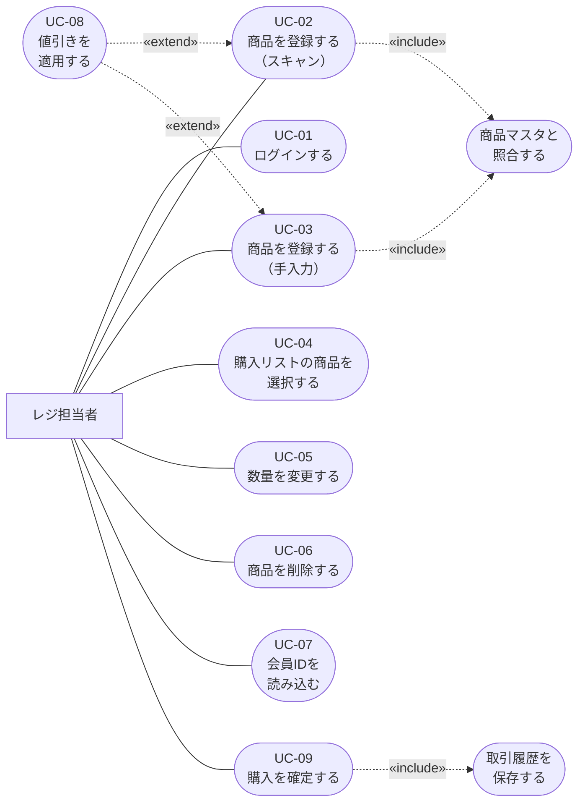

図中では、UC-04（選択）とUC-05／UC-06（数量変更／削除）の関係は「選択済みであることが事前条件」という状態依存であり、UML上の «include»（部分機能の呼び出し）には当たらないため、矢印では結ばずアクターからの直接の関連として表現し、事前条件欄（2.3.2）で依存関係を明示している。同様にUC-07（会員ID読み込み）とUC-08（値引き適用）も「会員IDが入力済みであること」という事前条件による関係であり、値引きの発動自体はUC-02／UC-03の登録操作をトリガーとする «extend» として表現した。


---

## 3. 機能設計

### 3.1 機能一覧と要件定義書との対応表（トレーサビリティ）

要件定義書のFR（機能要件）・BR（業務要件）・SCR（画面要件）は、要求仕様書の記述単位に近い粒度で分割されている。本節では、これらを実装単位としてまとまりのある「設計上の機能ブロック」に再構成し、対応する要件IDを明示する。機能ブロックのIDは `F-xx` とする。

| 機能ID | 機能名 | 概要 | 対応FR/BR/SCR ID | 対応DR/IF/NFR ID | 備考 |
|---|---|---|---|---|---|
| F-01 | 認証機能 | 担当者ID・パスワードによるログイン認証。担当者情報を画面表示し以降の取引に紐づける | BR-001, FR-019, SCR-001, SCR-011 | DR-007, IF-001 | ログアウト機能は実装対象として確定している（ISS-010）。担当者アカウントの発行はSC-03画面または`POST /api/staff`から行う簡易登録機能を追加する（`[AI提案]`。権限チェックの詳細は詳細設計で検討） |
| F-02 | 商品登録機能（バーコードスキャン） | カメラでバーコードを読み取り商品コードとして認識し、商品マスタと照合の上、購入リストへ反映する | FR-001〜004, FR-020, FR-022, FR-023, SCR-002 | DR-001 | スキャン失敗時の挙動は `[要確認 ISS-009]`（`[AI提案]` FR-020）。商品マスタ未登録時のエラーはFR-023で確定 |
| F-03 | 商品登録機能（手入力） | 商品コードを手入力し、商品マスタと照合の上、購入リストへ反映する | FR-005, SCR-008 | DR-001 | 入力確定操作はEnterキー押下で確定する（専用ボタンは設けない） |
| F-04 | 購入リスト管理機能 | 購入リストの一覧表示、商品の選択・数量変更・削除、小計／合計金額の再計算 | FR-006〜010, SCR-003, SCR-004, SCR-005, SCR-009 | DR-002 | |
| F-05 | 値引き機能 | 会員向けの期間限定値引きを対象商品に適用し、値引き額を表示する | BR-002, FR-011, FR-012, SCR-006 | DR-003 | 値引き対象・期間・内容の変更手段は、管理者ロール（admin）限定のF-10（値引き・税率管理機能）で提供する。会員ID入力前スキャン分への遡及適用は行わない（現行設計を維持、確定、ISS-006）。複数値引きの併用は不可とし、1商品1値引きのみで重複登録を禁止する。discount_type='amount'の値引き額は商品1個あたりの金額であり、明細行の値引き合計は`discount_value × quantity`で計算する |
| F-06 | 会員ID読み込み機能 | 会員IDをバーコードスキャン等で読み込み、取引に紐づける | FR-013〜015, SCR-012 | DR-004 | 存在しない会員IDが入力された場合はエラー（404）として入力を拒否する。「お客様ID読み込みボタン」は専用ボタンとして設ける |
| F-07 | 税表示・税率管理機能 | 購入確定時の税込・税抜合計金額の算出・表示。商品ごとの税区分（標準／軽減）に応じた消費税率の可変管理 | FR-017, FR-018, SCR-007 | DR-006 | 税率の変更手段は、管理者ロール（admin）限定のF-10（値引き・税率管理機能）で提供する。商品ごとの税区分（標準／軽減）に応じて異なる税率を適用する（スコープ内）。購入確定操作でポップアップを表示し、税込・税抜合計金額を両方提示する |
| F-08 | 購入確定・取引記録機能 | 購入内容を確定し、取引履歴（日時・商品・数量・金額・会員・担当者・値引き適用内容）をDBへ永続化する | BR-004, FR-016, FR-021, SCR-010 | DR-005, NFR-001 | 確定後は購入リスト・会員ID・コード入力欄を全てクリアして次の取引へ進む |
| F-09 | 商品マスタ単価変更履歴記録 | 商品マスタの単価が変更された場合に、変更前後の単価・変更日時を記録する。確定済み取引は変更前単価のまま保持する | BR-003, FR-016 | DR-008 | 商品マスタを変更するための画面・API自体は対象外として確定している（商品マスタ登録・編集機能のスコープ、ISS-004）ため、本書では4章（画面設計）・6章（API設計）の対象外とし、5章のテーブル定義のみ用意する |
| F-10 | 値引き・税率管理機能 | 値引きマスタ（DISCOUNTS）・消費税率マスタ（TAX_RATES）の登録・編集を、管理者ロール（BR-005）限定で行う | FR-025, BR-005 | ― | 管理者ロール（admin）限定の管理画面（4章SC-04）・API（6章）を新設する機能ブロックである |

#### トレーサビリティ確認

- 要件定義書のFR-001〜023, FR-025、BR-001〜005、SCR-001〜012は、上記F-01〜F-10のいずれかに対応しており、機能ブロックへの割り当て漏れはない。
- 決済・レシート発行・返品・在庫管理・商品マスタ登録編集画面・会員登録機能など、要件定義書で対象外として確定している（ISS-003, ISS-004, ISS-020〜022）事項は、機能ブロックとして起こしていない。9章「未決事項・今後の検討課題」で再掲する。

---

### 3.2 主要業務フローのアクティビティ図

要件定義書上、レジ業務における中心的な2つのフロー（商品登録処理、購入確定処理）を選定した。いずれも要件定義書のFR/BR/DRの複数項目にまたがる業務上重要度の高いフローである。

#### 3.2.1 商品登録処理フロー（F-02／F-03／F-05）

バーコードスキャンと手入力は、商品マスタ照合以降の処理が共通であるため（要件定義書「Lv1→Lv2 変更点対応表」参照）、1つのアクティビティ図にまとめる。

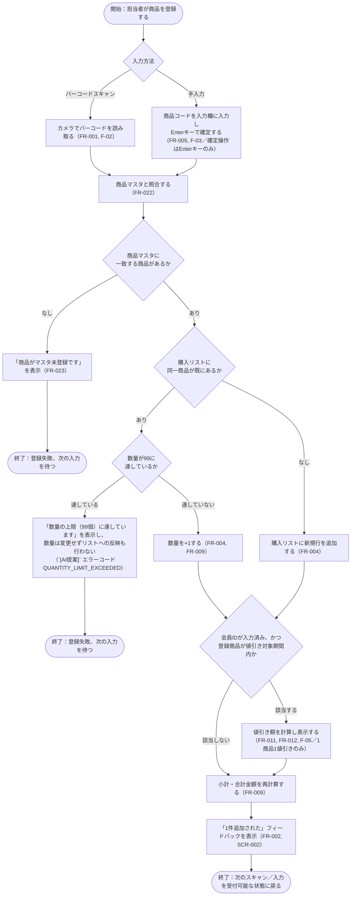

**フロー説明**: バーコード認識に失敗した場合（スキャン自体が読み取れない場合）のエラー処理は要求仕様書に明記がなく `[AI提案]`（FR-020）であるため、上図では「商品マスタに一致する商品がない」（FR-023、確定要件）場合のみを分岐として明示し、スキャン失敗自体の扱いは注記に留めている（`[要確認 ISS-009]`）。また、同一商品の再スキャン・再入力によって数量が99（FR-008の上限）に達している場合は、数量を99のまま維持したままエラーを表示してスキャン・追加操作を拒否する（対応するエラーコードQUANTITY_LIMIT_EXCEEDEDは`[AI提案]`、詳細は6章参照）。

#### 3.2.2 購入確定処理フロー（F-07／F-08）

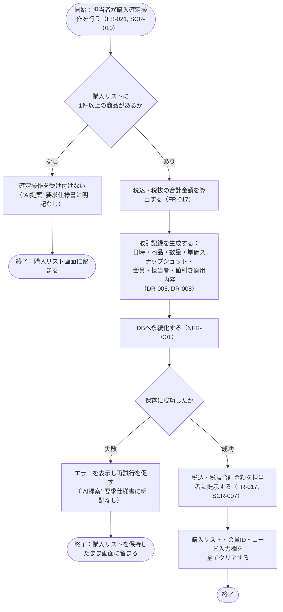

**フロー説明**: 購入リストが0件の場合の確定操作拒否、および保存失敗時のエラーハンドリングは要求仕様書に明記がないため `[AI提案]` として設計上補ったフローである。確定後は、Lv1のREQ-059に類似の記述を踏まえ、「購入リスト・会員ID・コード入力欄を全てクリアして次の取引へ進む」仕様とする。


---

## 4. 画面設計

要件定義書8章（画面要件）の注記のとおり、画面レイアウトの一次資料はLv1に添付された1点の画面イメージ（`_lv1_image1.png`）のみであり、Lv2で追加された画面要素についてはレイアウト図がなく「何を表示すべきか」の水準にとどまる（ISS-002：部分解消）。そのため本章では、画面の正確な配置・見た目を確定図として示すのではなく、**画面項目定義（何を・どの種別で持つか）を主とし、レイアウトはLv1画像から読み取れる範囲＋設計上の配置案（`[AI提案]`）として補足する**方針をとる。

### 4.1 画面一覧

| 画面ID | 画面名 | 概要 | 出典 | 備考 |
|---|---|---|---|---|
| SC-01 | ログイン画面 | 担当者ID・パスワードを入力し認証する専用画面 | SCR-001 | ログイン成功でSC-02へ遷移 |
| SC-02 | POSメイン画面（レジ業務画面） | 商品登録・購入リスト操作・会員ID読み込み・値引き表示・税表示・購入確定を行う単一画面 | SCR-002〜SCR-012 | Lv1画像に基づく既存要素＋Lv2で追加された要素を統合。詳細は4.2 |
| SC-03 | 担当者登録画面（簡易） | レジ担当者アカウント（担当者ID・パスワード・氏名）を簡易に登録する画面 | `[AI提案]` | `POST /api/staff`（6章）と対応する簡易登録画面。権限チェックの詳細は詳細設計で検討 |
| SC-04 | 値引き・税率管理画面（管理者限定） | 値引きマスタ（DISCOUNTS）・消費税率マスタ（TAX_RATES）の一覧表示・登録を行う画面。管理者ロール（role=admin）限定 | FR-025, BR-005 | 3章F-10、6章の値引き・税率管理APIと対応。一般ロール（staff）でログインした担当者はアクセス不可 |

決済・レシート発行・返品・在庫管理・商品マスタ登録編集・会員登録などの画面は、対応する機能が対象外として確定している（ISS-003, ISS-004, ISS-020〜022）ため、画面一覧に含めない。

購入確定時の金額提示についても、Lv1には「ポップアップ等で表示」（REQ-058）という記述があり、購入確定操作でポップアップを表示し、税込・税抜合計金額を両方提示する。独立した画面IDは付与せずSC-02内の一要素（4.2節 No.16）として扱う。

---

### 4.2 主要画面の項目定義

#### 4.2.1 SC-01 ログイン画面

| No | 項目名 | 種別 | 内容 | 出典 | 備考 |
|---|---|---|---|---|---|
| 1 | 担当者ID入力欄 | 入力 | レジ担当者の担当者IDを入力する | REQ-026, REQ-060 | |
| 2 | パスワード入力欄 | 入力 | パスワードを入力する（マスク表示） | REQ-026, REQ-060 | マスク表示は `[AI提案]`（一般的なUI慣行として補うが要求仕様書に明記なし） |
| 3 | ログインボタン | 操作 | 入力内容で認証を行う | REQ-026, REQ-060 | |
| 4 | エラーメッセージ表示エリア | 表示 | ID・パスワード誤りの際にエラーを伝える | REQ-027, REQ-063 | |

簡易レイアウト案（`[AI提案]`）:

```
┌─────────────────────────┐
│         ログイン           │
│  担当者ID  [__________]  │
│  パスワード [__________]  │
│         [ ログイン ]       │
│  (エラーメッセージ表示欄)    │
└─────────────────────────┘
```

#### 4.2.2 SC-02 POSメイン画面（レジ業務画面）

Lv1画像で確認できる要素（①読み込みボタン／②コード入力エリア／③名称表示エリア／④単価表示エリア／⑤購入リストへ追加ボタン／⑥購入品目リスト／⑦購入ボタン、および担当者情報・会員ID表示）を土台とし、Lv2で追加が確認できる要素（バーコードスキャン、値引き表示、数量変更UI、税込税抜表示）を統合する。

| No | 項目名 | 種別 | 内容 | 出典 | 備考 |
|---|---|---|---|---|---|
| 1 | 担当者情報表示エリア | 表示 | ログイン中のレジ担当者情報を表示 | SCR-011 | Lv2に矛盾する記述なし。継続前提（要件定義書5章） |
| 2 | 会員ID表示エリア | 表示 | 読み込み済みの会員IDを表示 | SCR-012 | |
| 3 | 会員IDスキャン／入力操作 | 操作 | 会員カードのバーコードスキャン等で会員IDを読み込む | FR-013 | 「お客様ID読み込みボタン」は専用ボタンとして設ける。存在しない会員IDが入力された場合はエラー（404 MEMBER_NOT_FOUND）として入力を拒否する |
| 4 | バーコードスキャンエリア（カメラ） | 操作 | カメラで商品バーコードを読み取る | FR-001, REQ-006 | |
| 5 | 商品コード手入力欄 | 入力 | 商品コードを手入力する | SCR-008, REQ-011, REQ-043 | 入力確定操作はEnterキー押下に確定する（専用ボタンは設けない） |
| 6 | 商品名称表示エリア | 表示 | 読み込み・入力された商品の名称を表示 | SCR-004, REQ-045 | Lv1の「一時表示」領域。手入力フローは名称・単価を一時表示し、追加ボタン操作で購入リストへ反映する |
| 7 | 商品単価表示エリア | 表示 | 読み込み・入力された商品の単価を表示 | SCR-004, REQ-046 | 同上 |
| 8 | 購入リストへ追加ボタン | 操作 | 検索結果（6・7）を購入リストへ反映する | REQ-047 | Lv2はバーコードスキャン時に直接リスト反映される記述（FR-001〜004）のため、本ボタンが必要なのは手入力フロー（SC-02 No.5）に限られる。手入力フローは名称・単価を一時表示し、追加ボタン操作で購入リストへ反映する |
| 9 | 購入品目リスト | 表示 | 購入リストの一覧（商品名・数量・単価・小計） | SCR-009, DR-002 | |
| 10 | 商品選択操作 | 操作 | リスト中の行をタップ等で選択する | FR-006, SCR-003 | 選択行は強調表示（SCR-003） |
| 11 | 数量変更UI | 操作 | 選択中商品の数量を1〜99の範囲で変更する | SCR-005, FR-007, FR-008 | UI形態（＋／－ボタン、直接入力等）は `[AI提案]` |
| 12 | 削除ボタン | 操作 | 選択中商品を購入リストから削除する | FR-010 | |
| 13 | 値引き表示 | 表示 | 値引きが適用された商品の値引き額を表示 | SCR-006 | |
| 14 | 合計金額表示（税込） | 表示 | 税込みの合計金額を表示 | SCR-007, FR-017 | |
| 15 | 合計金額表示（税抜） | 表示 | 税抜きの合計金額を表示 | SCR-007, FR-017 | Lv1内部に「税込みのみポップアップ」という矛盾する記述があったが、購入確定操作でポップアップを表示し、税込・税抜合計金額を両方提示する |
| 16 | 購入確定ボタン／確定結果表示 | 操作／表示 | 購入を確定し、税込・税抜合計金額を提示する | SCR-010, FR-017 | 購入確定操作でポップアップを表示し、税込・税抜合計金額を両方提示する。確定後は購入リスト・会員ID・コード入力欄を全てクリアする |
| 17 | スキャン成功フィードバック | 表示 | バーコード認識成功時に「1件追加された」ことを示す | SCR-002 | 表現形式（トースト通知等）は `[AI提案]` |
| 18 | エラーメッセージ表示エリア | 表示 | 商品マスタ未登録等のエラーを表示 | FR-023 | |

簡易レイアウト案（`[AI提案]`。Lv1画像の配置を踏襲しつつLv2要素を追加した一案であり、確定レイアウトではない）:

```
┌───────────────────────────────────────────────┐
│ 担当者：〇〇  会員ID：[____________] [スキャン]│ … No.1〜3
├───────────────────────────────────────────────┤
│ [バーコードスキャン]  コード[______] [読込]     │ … No.4〜5
│ 名称：__________  単価：______  [追加]          │ … No.6〜8
├───────────────────────────────────────────────┤
│ 購入品目リスト                                   │
│  商品名 | 数量(-+) | 単価 | 小計 | 値引き        │ … No.9〜13
│  ...                                             │
│                                    [削除]        │ … No.12
├───────────────────────────────────────────────┤
│ 合計（税込）：¥____   合計（税抜）：¥____        │ … No.14〜15
│                              [ 購入確定 ]        │ … No.16
└───────────────────────────────────────────────┘
```

#### 4.2.3 SC-03 担当者登録画面（簡易）

`[AI提案]`：レジ担当者アカウントの発行経路として追加した簡易な登録画面である。要求仕様書に本画面に関する記載はなく、権限チェック（誰が担当者登録を行えるか等）の詳細は詳細設計で検討する。

| No | 項目名 | 種別 | 内容 | 出典 | 備考 |
|---|---|---|---|---|---|
| 1 | 担当者ID入力欄 | 入力 | 新規に発行する担当者IDを入力する | `[AI提案]` | 文字数制約は6.2節参照（4〜12文字） |
| 2 | パスワード入力欄 | 入力 | 担当者の初期パスワードを入力する（マスク表示） | `[AI提案]` | 文字数制約は6.2節参照（8〜16文字） |
| 3 | 氏名入力欄 | 入力 | 担当者氏名を入力する（SCR-011表示用） | `[AI提案]` | |
| 4 | 登録ボタン | 操作 | 入力内容で`POST /api/staff`（6章）を呼び出し、担当者を登録する | `[AI提案]` | |

簡易レイアウト案（`[AI提案]`）:

```
┌─────────────────────────┐
│      担当者登録（簡易）      │
│  担当者ID  [__________]  │
│  パスワード [__________]  │
│  氏名     [__________]  │
│         [ 登録 ]         │
└─────────────────────────┘
```

#### 4.2.4 SC-04 値引き・税率管理画面（管理者限定）

値引きマスタ（DISCOUNTS）・消費税率マスタ（TAX_RATES）を、コード変更なしに登録・編集できるようにする管理画面（FR-012, FR-018の変更手段を提供、BR-005・FR-025）。3章F-10、6章の値引き・税率管理API（`GET/POST /api/discounts` 等）と対応する。

| No | 項目名 | 種別 | 内容 | 出典 | 備考 |
|---|---|---|---|---|---|
| 1 | 値引き一覧表示 | 表示 | 登録済みの値引き（DISCOUNTS）を一覧表示する（商品コード・種別〈rate/amount〉・値・開始日・終了日） | FR-025, BR-005 | `[AI提案]`：一覧の並び順・ページングの詳細は詳細設計で検討 |
| 2 | 値引き登録フォーム | 入力／操作 | 対象商品コード・種別（rate/amount）・値・開始日・終了日を入力し、登録ボタンで`POST /api/discounts`（6章）を呼び出す | FR-012, FR-025, BR-005 | 同一商品・重複期間の登録は409エラー（6章6.4.11節参照、1商品1値引きの制約との整合） |
| 3 | 消費税率一覧表示 | 表示 | 登録済みの消費税率（TAX_RATES）を一覧表示する（税率・税区分〈standard/reduced〉・適用開始日） | FR-025, BR-005 | `[AI提案]` |
| 4 | 消費税率登録フォーム | 入力／操作 | 税率・税区分（standard/reduced）・適用開始日を入力し、登録ボタンで`POST /api/tax-rates`（6章）を呼び出す | FR-018, FR-025, BR-005 | |

**アクセス制御**: 本画面は管理者ロール（role=admin）でログインした担当者のみアクセス可能とする。一般ロール（role=staff）でログインした担当者が本画面へ遷移しようとした場合はアクセス不可とする（画面側での非表示・遷移拒否に加え、6章のAPI側でも`403 FORBIDDEN`（`ADMIN_ROLE_REQUIRED`）により拒否する多層防御とする。7.4.1節参照）。

簡易レイアウト案（`[AI提案]`）:

```
┌───────────────────────────────────────────────┐
│  値引き・税率管理（管理者限定）                     │
├───────────────────────────────────────────────┤
│ 値引き一覧                                        │
│  商品コード | 種別(rate/amount) | 値 | 開始日 | 終了日│ … No.1
│  ...                                             │
│ [商品コード___][種別▼][値___][開始日___][終了日___][登録]│ … No.2
├───────────────────────────────────────────────┤
│ 消費税率一覧                                       │
│  税率 | 税区分(standard/reduced) | 適用開始日        │ … No.3
│  ...                                             │
│ [税率___][税区分▼][適用開始日___]        [登録]     │ … No.4
└───────────────────────────────────────────────┘
```


---

## 5. データ設計

### 5.1 ER図

要件定義書のデータ要件（DR-001〜DR-008）をもとに、永続化が必要なエンティティを抽出した。DR-002（購入リストの行データ）については、要求仕様書上「購入確定前の状態を保存しておく」という永続化要件が存在しないため、DBテーブルとしては設計せず、購入確定後にのみ `TRANSACTION_ITEMS` として永続化する前提とした（`[AI提案]`：購入リスト自体はフロントエンド（Next.js）側の状態管理として保持することに確定した。D-ISS-02、9.2節参照）。

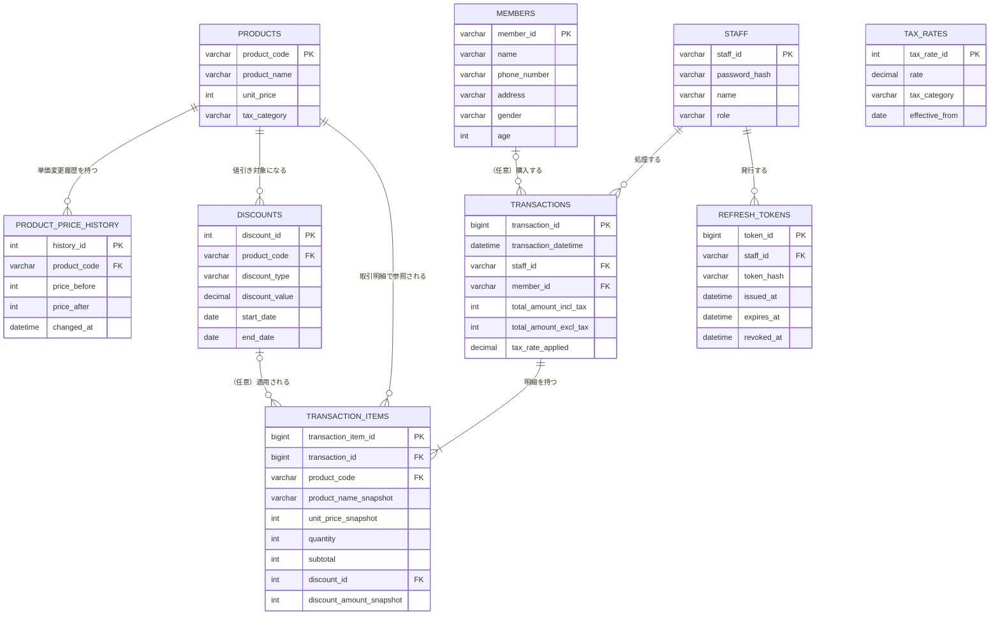

**設計上の主な判断（`[AI提案]`として明示する事項）**:

- `TAX_RATES` は他テーブルと直接のリレーションを持たない独立マスタとした。取引確定時点の税率は `TRANSACTIONS.tax_rate_applied` にスナップショットとして複製し、BR-003（単価改定時の過去取引保護）と同じ考え方で、後から `TAX_RATES` の値が変わっても過去の取引記録が変化しないようにしている。
- `DISCOUNTS` は1レコード＝1対象商品という単純な構造とした。複数値引きの併用は不可とし、同一商品への重複登録を禁止する制約を設ける。値引きマスタの変更手段は、管理者ロール限定の管理画面・API（詳細はSTAFF節のrole列、4章SC-04、6章参照）で提供する。
- `PRODUCTS`・`TAX_RATES`に`tax_category`（standard=標準／reduced=軽減）を追加し、商品ごとの軽減税率対応をスコープ内とした。現在有効な税率の選定は「同一tax_categoryの中でeffective_fromが本日以前かつ最新の1件」とする（`[AI提案]`、詳細はTAX_RATES節参照）。TAX_RATESの登録・編集手段も、DISCOUNTSと同様に管理者ロール限定のF-10（値引き・税率管理機能）で提供する。
- `STAFF`への新規登録経路として、SC-03画面（簡易版）または`POST /api/staff`からの簡易登録機能を追加した（`[AI提案]`。権限チェックの詳細は詳細設計で検討）。あわせて、連続認証失敗時のログインロックアウトのため`failed_login_count`・`locked_until`を追加した（具体的な回数・時間の暫定値は`[AI提案]`であり`[要確認]`）。さらに、`role`列（`staff`＝一般／`admin`＝管理者、BR-005）を追加し、値引き・消費税率マスタの変更操作を管理者ロール限定とするRBAC（Role-Based Access Control）を導入した（詳細は7.4.1節）。
- `TRANSACTIONS`には購入確定APIの二重送信対策として`idempotency_key`（UNIQUE制約）を追加した（`[AI提案]`。設計思想は7.4.2(7)節参照）。
- `REFRESH_TOKENS`は、7.4.1節のリフレッシュトークン失効管理（ログアウト機能の実現に必要、ISS-010で実装対象として確定）のため新設した（D-ISS-08、追加することで確定）。リフレッシュトークン文字列自体はDBに平文保存せず`token_hash`としてハッシュ化して保持する（`[AI提案]`）。ログイン時（6.4.1節）に発行記録を1件作成し、`/api/auth/refresh`（6.4.2節）の呼び出し時に`revoked_at`がNULLかつ`expires_at`が未経過であることを検証し、ログアウト時（6.4.3節）に`revoked_at`へ失効日時をセットする。
- `MEMBERS` のカラムは要件定義書DR-004（DR-004出典REQ-030, REQ-066）に記載された項目（会員ID・氏名・電話番号・住所・性別・年齢）をそのまま反映した。会員登録・編集機能自体はISS-022により対象外として確定しているため、このテーブルへのデータ投入経路（画面／バッチ／他システム連携）は本書の設計対象に含めない。
- `STAFF.name`（担当者氏名）は要件定義書に明記がなく、SCR-011「担当者情報を画面表示する」を実装する上で必要と考えられるため `[AI提案]` として追加した。
- パスワードは平文でなく `password_hash` として保存する設計とした。ハッシュ化アルゴリズムの指定は要件定義書に記載がなく（NFR-SEC-001は「最低限の保護が必要」という抽象的な記述に留まる、ISS-016）、具体的な方式は7章で改めて扱う。

---

### 5.2 テーブル定義書

#### PRODUCTS（商品マスタ）

| カラム名 | 型 | 制約 | 備考 |
|---|---|---|---|
| product_code | VARCHAR(20) | PK, NOT NULL | 商品コードは8〜13桁（JAN／EAN想定）とする。型はVARCHAR(20)のまま前方互換のため余裕を持たせる |
| product_name | VARCHAR(255) | NOT NULL | |
| unit_price | INT | NOT NULL | 現行単価。税込／税抜どちらで保持するかは要求仕様書に明記なく `[AI提案]`（税抜で保持し、表示時に税率を乗じる方式を想定） |
| tax_category | VARCHAR(10) | NOT NULL, DEFAULT 'standard' | 商品ごとの税区分（standard=標準／reduced=軽減）。軽減税率対応をスコープ内とし追加 |
| created_at | DATETIME | NOT NULL, DEFAULT CURRENT_TIMESTAMP | `[AI提案]` |
| updated_at | DATETIME | NOT NULL | `[AI提案]` |

商品マスタへの新規登録・編集経路は対象外として確定している（ISS-004）ため、本テーブルへの書き込みAPI・画面は6章・4章の対象外とする。

#### PRODUCT_PRICE_HISTORY（商品単価変更履歴）

| カラム名 | 型 | 制約 | 備考 |
|---|---|---|---|
| history_id | INT | PK, AUTO_INCREMENT | |
| product_code | VARCHAR(20) | FK → PRODUCTS.product_code, NOT NULL | |
| price_before | INT | NOT NULL | |
| price_after | INT | NOT NULL | |
| changed_at | DATETIME | NOT NULL | |

出典：DR-008（REQ-036括弧内「単価変更の履歴を含む」）

#### MEMBERS（会員マスタ）

| カラム名 | 型 | 制約 | 備考 |
|---|---|---|---|
| member_id | VARCHAR(20) | PK, NOT NULL | ID規格は要求仕様書に記載なし `[要確認]` |
| name | VARCHAR(255) | NOT NULL | |
| phone_number | VARCHAR(20) | NULL可 | |
| address | VARCHAR(255) | NULL可 | |
| gender | VARCHAR(10) | NULL可 | |
| age | INT | NULL可 | 要求仕様書の記載どおり「年齢」として保持（生年月日ではない）。経年で値が陳腐化する運用上の課題は `[AI提案の懸念点]` として9章に記載 |

出典：DR-004（REQ-028, REQ-030, REQ-032, REQ-066）

#### STAFF（レジ担当者マスタ）

| カラム名 | 型 | 制約 | 備考 |
|---|---|---|---|
| staff_id | VARCHAR(20) | PK, NOT NULL | 文字数は4〜12文字（6.2節） |
| password_hash | VARCHAR(255) | NOT NULL | 平文禁止。ハッシュ方式は `[要確認 ISS-016]` |
| name | VARCHAR(255) | NULL可 | `[AI提案]`。SCR-011表示のために追加 |
| role | VARCHAR(20) | NOT NULL, DEFAULT 'staff' | 一般（`staff`）・管理者（`admin`）の2ロール（BR-005）。値引き・消費税率マスタの変更（F-10、4章SC-04、6章の値引き・税率管理API）は`admin`ロールのみ実行可能（詳細は7.4.1節） |
| failed_login_count | INT | NOT NULL, DEFAULT 0 | `[AI提案]` ログイン試行回数制限（ロックアウト）のための連続認証失敗回数カウンタ（7.4.1節参照） |
| locked_until | DATETIME | NULL可 | `[AI提案]` ロックアウト解除予定日時（NULLの場合ロックなし）。連続5回認証失敗で15分間ロックする暫定値（`[AI提案]`）を用いるが、具体的な回数・時間自体は引き続き `[要確認]` |

出典：DR-007（REQ-026, REQ-060）

**登録経路（`[AI提案]`）**：担当者アカウントの新規登録は、SC-03画面（簡易版、4章参照）または`POST /api/staff`（簡易登録API、6章参照）から行う。権限チェック（誰が担当者登録を行えるか）の詳細は詳細設計で検討する。

#### DISCOUNTS（値引きマスタ）

| カラム名 | 型 | 制約 | 備考 |
|---|---|---|---|
| discount_id | INT | PK, AUTO_INCREMENT | |
| product_code | VARCHAR(20) | FK → PRODUCTS.product_code, NOT NULL | 1値引き＝1対象商品の単純化。複数商品への一括適用は行わない方針とする。同一product_codeで有効期間が重複するレコードは登録を禁止する（アプリケーション層またはDB制約での重複チェック、`[AI提案]`） |
| discount_type | ENUM('rate','amount') | NOT NULL | 割合値引き・金額値引きの両方に対応（REQ-021） |
| discount_value | DECIMAL(10,2) | NOT NULL | rateの場合は％（例：20％引きは`20.00`）、amountの場合は商品1個あたりの値引き額（円）。明細行の値引き合計は`discount_value × quantity`で計算する。**`[AI提案]` 表記規約の注意**：本テーブルのrateは百分率表記だが、TAX_RATES.rateは小数表記（例：10％は`0.10`）であり、両者の規約は統一していない。実装時に混同しないよう注意（詳細はTAX_RATES節を参照） |
| start_date | DATE | NOT NULL | |
| end_date | DATE | NOT NULL | |

出典：DR-003（REQ-020, REQ-021, REQ-023）。変更手段（コード変更なしに変更・追加できる状態）は、管理者ロール限定の管理画面（4章SC-04）・API（6章）により提供する

**`[AI提案]` 重複登録の禁止**: 1商品につき同時に有効な値引きは1件のみとし、複数値引きの併用は不可とする。同一`product_code`に対して有効期間（start_date〜end_date）が重複するDISCOUNTS行を登録できないよう、アプリケーション層またはDB制約（重複チェックの具体的な実装方式は`[AI提案]`）で重複登録を禁止する。

#### TAX_RATES（消費税率マスタ）

| カラム名 | 型 | 制約 | 備考 |
|---|---|---|---|
| tax_rate_id | INT | PK, AUTO_INCREMENT | |
| tax_category | VARCHAR(10) | NOT NULL | 税区分（standard=標準／reduced=軽減）。商品ごとの軽減税率対応をスコープ内としたため追加 |
| rate | DECIMAL(5,4) | NOT NULL | 複数税率（軽減税率）に対応。**`[AI提案]` 表記規約**：小数表記（例：10％は`0.10`）。DISCOUNTS.discount_value（rateの場合は百分率表記）とは規約が異なる点に注意 |
| effective_from | DATE | NOT NULL | |

出典：DR-006（REQ-034, REQ-071）

**`[AI提案]` 「現在有効な税率」の選定ロジック**: 本テーブルは`tax_category`ごと・`effective_from`ごとに複数行を持てる構造とした。現在有効な税率は、「同一`tax_category`の中で、`effective_from`が本日以前である行のうち、`effective_from`が最も新しい1件」を採用する。この選定ロジック自体は要求仕様書に記載がなく`[AI提案]`である。

#### TRANSACTIONS（取引ヘッダ）

| カラム名 | 型 | 制約 | 備考 |
|---|---|---|---|
| transaction_id | BIGINT | PK, AUTO_INCREMENT | |
| idempotency_key | VARCHAR(64) | UNIQUE, NOT NULL | 購入確定APIの二重送信対策（`[AI提案]`）。クライアント生成のUUID等を想定。同一キーでの再送時は新規登録せず既存の取引結果をそのまま返す（7.4.2(7)節参照） |
| transaction_datetime | DATETIME | NOT NULL | |
| staff_id | VARCHAR(20) | FK → STAFF.staff_id, NOT NULL | |
| member_id | VARCHAR(20) | FK → MEMBERS.member_id, NULL可 | 会員なし取引を許容（FR-015） |
| total_amount_incl_tax | INT | NOT NULL | |
| total_amount_excl_tax | INT | NOT NULL | |
| tax_rate_applied | DECIMAL(5,4) | NOT NULL | 確定時点の税率スナップショット `[AI提案]` |

出典：DR-005（REQ-025, REQ-036, REQ-057, REQ-064）

#### TRANSACTION_ITEMS（取引明細）

| カラム名 | 型 | 制約 | 備考 |
|---|---|---|---|
| transaction_item_id | BIGINT | PK, AUTO_INCREMENT | |
| transaction_id | BIGINT | FK → TRANSACTIONS.transaction_id, NOT NULL | |
| product_code | VARCHAR(20) | FK → PRODUCTS.product_code, NOT NULL | |
| product_name_snapshot | VARCHAR(255) | NOT NULL | 単価改定後も購入時点の名称・単価を保持（BR-003） |
| unit_price_snapshot | INT | NOT NULL | |
| quantity | INT | NOT NULL | 1〜99（FR-008） |
| subtotal | INT | NOT NULL | |
| discount_id | INT | FK → DISCOUNTS.discount_id, NULL可 | |
| discount_amount_snapshot | INT | NULL可, DEFAULT 0 | |

出典：DR-005, DR-008

#### REFRESH_TOKENS（リフレッシュトークン発行記録）

| カラム名 | 型 | 制約 | 備考 |
|---|---|---|---|
| token_id | BIGINT | PK, AUTO_INCREMENT | |
| staff_id | VARCHAR(20) | FK → STAFF.staff_id, NOT NULL | |
| token_hash | VARCHAR(255) | NOT NULL | リフレッシュトークン自体を平文でDBに保存せず、ハッシュ化して保持する（`[AI提案]`） |
| issued_at | DATETIME | NOT NULL | 発行日時 |
| expires_at | DATETIME | NOT NULL | 有効期限（発行時点から8時間後、6.2節参照） |
| revoked_at | DATETIME | NULL可 | ログアウト時（6.4.3節）にセットする失効日時。NULLの場合は有効 |

出典：D-ISS-08（追加することで確定）。7.4.1節のリフレッシュトークン失効管理（ログアウト機能ISS-010の実現に必要）のために新設したテーブルであり、カラム構成自体は要求仕様書に根拠のない `[AI提案]` である。

---

### 5.3 クラス図

主要エンティティ（5.1のER図に対応するドメインクラス）と、3章で定義した機能ブロック（F-01〜F-09）に対応するサービスクラスの関係を示す。サービスクラスの分割・命名はいずれも `[AI提案]` であり、要件定義書がフロントエンド（Next.js）とバックエンド（FastAPI）の役割分担（CON-006）を確定要件としつつ具体的な分割方法までは規定していないため、実装時の詳細設計で見直される前提とする。

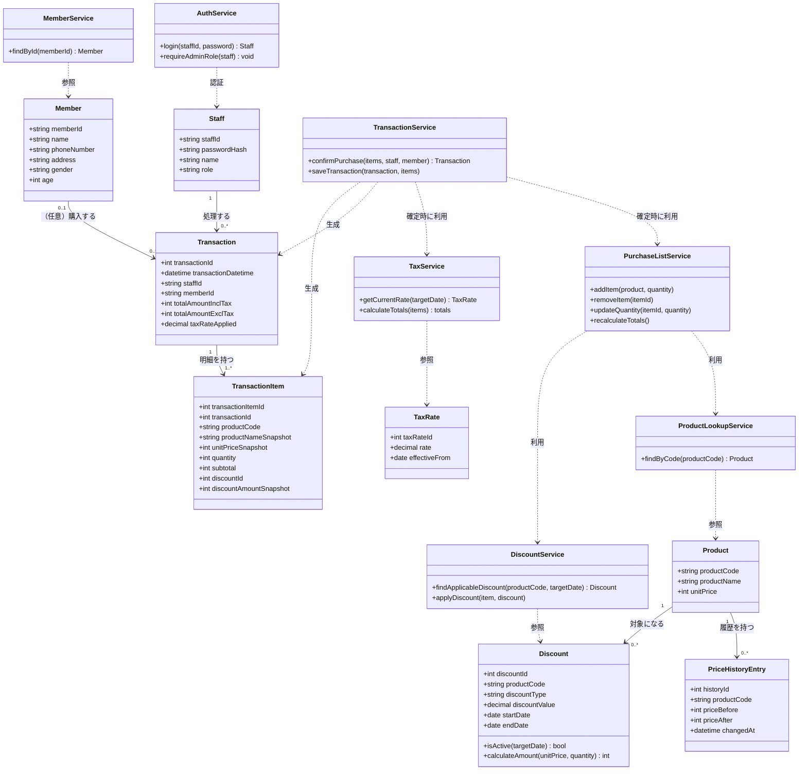

**`Discount.calculateAmount()`の計算式**: `discount_type='amount'`の値引きにおける`discount_value`は「商品1個あたり」の値引き額であり、明細行全体の値引き合計は`discount_value × quantity`で算出する。`discount_type='rate'`の場合は`unitPrice × quantity × (discount_value / 100)`で算出する。

**`AuthService.requireAdminRole()`について**: `Staff.role`（`staff`＝一般／`admin`＝管理者、BR-005）を検証し、`admin`でない場合は呼び出し元に認可エラーを返すメソッドである。F-10（値引き・税率管理機能）のAPI（6章）で、リクエスト元担当者のroleが`admin`であることを確認するために利用する想定（`[AI提案]`：メソッド分割・命名自体は要求仕様書に根拠なし）。詳細な認可設計は7.4.1節を参照。

**備考**: `PurchaseListService` は、購入確定前の購入リスト状態（DR-002相当）を扱うサービスであり、5.1節の判断のとおり対応するDBテーブルを持たない。保持先はフロントエンド（Next.js、ブラウザの状態管理）側の状態管理として実装することに確定した（D-ISS-02、発注者確認済み、9.2節参照）。バックエンド（FastAPI）側にセッション相当の一時状態として持たせる方式は採用しない。


---

## 6. API設計

本章は、6.1でエンドポイントの一覧（メソッド・パス・概要）を示した上で、6.2で各種入力値の設定値（上限・下限）、6.3でエラー処理方針、6.4で各エンドポイントの詳細な入出力仕様（パラメータ・型・制約・想定エラーレスポンス）を扱う。6.2〜6.4は後続プロンプトでの指示に基づき追加したものであり、6.1と整合させている。要件定義書・要求仕様書に根拠のない設定値・仕様は、他章と同様に `[AI提案]` として区別する。

CON-006（フロントエンド／バックエンドの役割分担）は確定要件だが、その具体的な分割基準（何をNext.js側のAPI Routeで処理し、何をFastAPI側のAPIとするか）までは要件定義書に記載がない。本章では、**認証（ログイン・トークン更新・ログアウト）・商品マスタ照会・会員照会・税率取得・取引確定という「DBへの読み書きを伴う処理」をFastAPI側のAPIとして設計し、購入リストの選択・数量変更・削除といった「確定前の一時的な画面状態の操作」はDBアクセスを伴わないためAPI化していない**、という方針をとる（5.3節のPurchaseListServiceに関する備考と対応。購入リストの保持先はフロントエンド〈Next.js、ブラウザの状態管理〉であることがD-ISS-02として確定している）。この方針自体は要求仕様書に明記された分担ルールではないため `[AI提案]` として扱う。

### 6.1 エンドポイント一覧

BFF（Next.js API Routes）は、以下で示す各FastAPIエンドポイントと同一のパス・メソッドでブラウザに公開し、内部でFastAPIの同名エンドポイントへプロキシする、という方針をとる（`[AI提案]`。詳細は7.4.2(1)節のBFF構成参照）。

| No | Method | パス | 概要 | 対応機能ID | 出典 | 備考 |
|---|---|---|---|---|---|---|
| 1 | POST | /api/auth/login | 担当者ID・パスワードで認証し、JWTアクセストークン・リフレッシュトークンを発行する（7.4.1節） | F-01 | BR-001, FR-019, REQ-026, REQ-027 | |
| 2 | POST | /api/auth/refresh | アクセストークンの有効期限切れ時、リフレッシュトークンを用いて新しいアクセストークンを再発行する | F-01 | ― | `[AI提案]`：7.4.1節のJWT設計（アクセストークン30分／リフレッシュトークン8時間）に伴い新設。要求仕様書に根拠なし |
| 3 | POST | /api/auth/logout | ログインセッション（リフレッシュトークンの発行記録）を無効化する | F-01 | ― | ログアウト機能は実装対象として確定している（ISS-010）。5章`REFRESH_TOKENS`の該当レコードに`revoked_at`をセットし、当該リフレッシュトークンを失効させる |
| 4 | GET | /api/products/{product_code} | 商品コードから商品マスタを照合し、名称・単価・有効な値引き情報を返す。バーコードスキャン・手入力共通の照合処理（3.2.1節「商品マスタと照合する」に対応） | F-02, F-03, F-05 | FR-022, FR-023, FR-011 | 商品未登録の場合は404相当のエラーレスポンスを返す想定（FR-023） |
| 5 | GET | /api/members/{member_id} | 会員IDから会員情報を照会し、存在確認を行う | F-06 | FR-014, FR-032 | 存在しない場合は404 MEMBER_NOT_FOUNDを返し、画面側は入力を拒否する |
| 6 | GET | /api/tax-rates/current | 現在有効な消費税率を取得する | F-07 | FR-018, DR-006 | エンドポイント形態（専用API化）は `[AI提案]`。商品ごとの税区分（標準／軽減）に対応するため、クエリパラメータ`tax_category`（standard/reduced）を追加した（設計判断は`[AI提案]`。詳細は6.4.6節） |
| 7 | POST | /api/transactions | 購入リストの内容・会員ID・担当者情報をもとに購入を確定し、サーバー側で金額を再計算・照合した上で取引記録（TRANSACTIONS／TRANSACTION_ITEMS）をDBへ保存する（7.4.2(3)節：金額二重検証）。二重送信対策としてクライアント生成の冪等キー（idempotency_key）を必須とする（`[AI提案]`、7.4.2(7)節） | F-08 | FR-016, FR-017, FR-021, NFR-001, DR-005, DR-008 | 税込・税抜合計金額をレスポンスとして返す想定（FR-017） |
| 8 | GET | /api/transactions/{transaction_id} | 確定済み取引の内容を照会する | ― | ― | `[AI提案]`：要求仕様書に根拠のない拡張ポイントとして例示。返品・レシート再発行等の将来機能（ISS-003関連）につながり得るが、現時点では設計・実装の対象としない |
| 9 | GET | /api/session | ログイン中の担当者情報（画面表示に必要な最小限の項目）を取得する | F-01 | SCR-011 | `[AI提案]`：レビュー指摘事項への対応として新設。7.4.1節のとおりJWTはhttpOnly Cookieに格納されブラウザのJavaScriptから読めないため、SCR-011（担当者情報表示）を実現するにはBFFが本APIを呼び出し、その結果を画面へ渡す必要がある |
| 10 | POST | /api/staff | 担当者ID・パスワード・氏名を登録する簡易登録API（4章SC-03画面から利用） | F-01 | ― | `[AI提案]`：権限チェックの詳細は詳細設計で検討する |
| 11 | GET | /api/discounts | 登録済みの値引き（DISCOUNTS）を一覧取得する（4章SC-04） | F-10 | FR-025, BR-005 | 管理者ロール（`admin`）限定。Authorizationヘッダーのアクセストークンの`role`クレームがadminであることをサーバー側で検証する（7.4.1節、`[AI提案]`：エンドポイント構成自体は要求仕様書に根拠なし） |
| 12 | POST | /api/discounts | 値引きを新規登録する（4章SC-04の値引き登録フォーム） | F-10 | FR-012, FR-025, BR-005 | 管理者ロール限定。同一商品・重複期間の登録は409エラー（ISS-007の「1商品1値引き」との整合、5章DISCOUNTS参照） |
| 13 | PUT | /api/discounts/{discount_id} | 既存の値引きを編集する | F-10 | FR-012, FR-025, BR-005 | 管理者ロール限定 |
| 14 | DELETE | /api/discounts/{discount_id} | 値引きを削除する | F-10 | FR-012, FR-025, BR-005 | 管理者ロール限定 |
| 15 | GET | /api/tax-rates | 登録済みの消費税率（TAX_RATES）を一覧取得する（4章SC-04）。No.6の`GET /api/tax-rates/current`（現在有効な1件のみ返す照会用API）とは別物 | F-10 | FR-025, BR-005 | 管理者ロール限定 |
| 16 | POST | /api/tax-rates | 消費税率を新規登録する（4章SC-04の消費税率登録フォーム） | F-10 | FR-018, FR-025, BR-005 | 管理者ロール限定 |

上記No.1〜3（認証系）はいずれもJWTの発行・検証・失効に関わるエンドポイントであり、詳細な設計思想は7.4.1節を参照。No.7（購入確定）の金額二重検証・冪等性の詳細設計は7.4.2(3)・7.4.2(7)節を参照。No.9（セッション情報取得）の設計思想は7.4.1節「セッション情報の取得」を参照。No.10（担当者簡易登録）は5章STAFFテーブルの登録経路と対応する。No.11〜16（値引き・税率管理API）は管理者ロール限定のAPI群であり、3章F-10・4章SC-04・5章DISCOUNTS／TAX_RATES・7.4.1節の認可モデルと対応する。

### 6.2 設定値定義

要件定義書に明記された制約（FR-008等）に加え、要求仕様書に記載のない項目については `[AI提案]` として暫定値を示す。実装・要確認事項の解消時にはこの表を正として各画面・APIのバリデーションを実装する。

| 項目名 | 下限 | 上限 | 根拠・備考 |
|---|---|---|---|
| 購入数量（1商品あたり） | 1 | 99 | FR-007, FR-008, REQ-017, REQ-018（確定要件）。上限到達時の再スキャンはエラー（QUANTITY_LIMIT_EXCEEDED）とし拒否する（3.2.1節参照） |
| 担当者ID文字数 | 4文字 | 12文字 | 半角英数字を想定。要求仕様書に文字数規定はない |
| パスワード文字数 | 8文字 | 16文字 | NFR-SEC-001「最低限の保護」を具体化したもの |
| パスワード文字種 | 英字・数字の両方を含む | ― | `[AI提案]` 要求仕様書に記載なし |
| 会員ID文字数 | 4文字 | 12文字 | 要求仕様書に規格の記載はない |
| 商品コード桁数 | 8桁 | 13桁 | JAN／EANコードを想定した8〜13桁 |
| 値引き率（discount_type=rate） | 0％ | 100％ | DISCOUNTS.discount_valueのバリデーション（REQ-021） |
| 値引き金額（discount_type=amount） | 0円 | 対象商品の単価未満 | 値引き後金額がマイナスにならないための制約 |
| 消費税率 | 0％ | 20％ | 現実的な運用範囲を想定した上限。複数税率（標準／軽減）のいずれにも共通の上限として適用する |
| 取引合計金額（税込／税抜） | 0円 | 99,999,999円 | DBカラム型（INT）の実務上限に基づく（DR-005） |
| JWTアクセストークン有効期限 | ― | 30分 | 7.4.1節参照 |
| JWTリフレッシュトークン有効期限 | ― | 8時間 | 7.4.1節参照（レジ1シフトを想定） |
| ログイン試行回数制限（連続認証失敗） | ― | 5回 | `[AI提案]`の暫定値。連続5回失敗でロックする方針だが、回数自体は`[要確認]`。7.4.1節参照 |
| ロックアウト時間 | ― | 15分 | `[AI提案]`の暫定値。上記の回数に達した場合のロック時間（`[要確認]`）。7.4.1節参照 |
| アイドルタイムアウト（無操作時間） | ― | 10分 | `[AI提案]`の暫定値。一定時間操作がない場合、フロントエンド側のタイマーで画面をログイン相当の状態に戻す。7.4.1節参照 |

### 6.3 エラー処理方針

要求仕様書にはエラー処理の分類・レスポンス形式に関する記載がなく、本節は全体が `[AI提案]` である。エラーは発生要因に応じて3種類に分類する。

| 分類 | 定義 | 例 | 想定HTTPステータス |
|---|---|---|---|
| バリデーションエラー | リクエストの形式・値が6.2節の設定値や必須項目の制約を満たさない、クライアント起因の入力不正 | 数量が範囲外（FR-008）、同一商品の数量が99の上限に達した状態での追加操作（`QUANTITY_LIMIT_EXCEEDED`、3.2.1節参照）、必須パラメータ欠落、文字数超過 | 400 Bad Request |
| 業務エラー | リクエスト形式は正しいが、業務ルール上処理を継続できない状態 | 商品マスタ未登録（FR-023）、会員ID不存在（404 MEMBER_NOT_FOUND）、認証失敗（REQ-027）、ログイン試行回数制限超過（`ACCOUNT_LOCKED`、`[AI提案]`、7.4.1節）、金額不一致（7.4.2(3)）、管理者ロール限定API（F-10、No.11〜16）への一般ロール（`staff`）担当者からのアクセス（`ADMIN_ROLE_REQUIRED`、7.4.1節）、値引きの重複登録（`DISCOUNT_PERIOD_CONFLICT`） | 401（認証失敗）／403（管理者ロール限定APIへの権限不足）／404（未登録）／409（金額不一致・値引き重複等の競合）／423（アカウントロック） |
| システムエラー | サーバー内部の予期しない異常 | DB接続失敗、未処理例外 | 500 Internal Server Error |

**レスポンス形式（`[AI提案]`）**: エラーは共通のJSON形式で返却する。

```json
{
  "error": {
    "type": "validation_error",
    "code": "QUANTITY_OUT_OF_RANGE",
    "message": "数量は1〜99の範囲で指定してください",
    "details": { "field": "quantity", "value": 150 }
  }
}
```

- `type`：`validation_error` / `business_error` / `system_error` のいずれか
- `code`：機械可読なエラーコード（画面側の分岐処理に使用）
- `message`：画面に表示してよい日本語メッセージ
- `details`：エラー箇所の補足情報（任意）

**システムエラー時の情報開示方針**: システムエラーのレスポンスにはスタックトレースや内部例外メッセージ、SQL文などの内部実装詳細を一切含めない（`[AI提案]`）。詳細はサーバー側のログにのみ記録し、クライアントへは汎用的なメッセージ（例：「一時的なエラーが発生しました。しばらくしてから再度お試しください」）のみを返す。これは、エラーメッセージからシステム構成やDB構造が推測されることを防ぐための対策であり、講義で扱ったセキュリティ対策の考え方（内部情報の非開示）を踏まえた提案である。

**画面での表示方法（`[AI提案]`）**:

| 分類 | 画面での表示方法 |
|---|---|
| バリデーションエラー | 該当する入力欄の直下にインラインでエラーメッセージを表示し、即時にフィードバックする |
| 業務エラー | 画面上部またはポップアップ／トースト通知でエラーメッセージを表示する（例：「商品がマスタ未登録です」FR-023、「金額が一致しませんでした。もう一度商品をご確認のうえお試しください（商品の価格や値引き内容が変更された可能性があります）」7.4.2(3)） |
| システムエラー | 汎用エラーメッセージと再試行操作を提示する。内部詳細は表示しない |

購入確定時の税表示形式は4.2.2節のとおりポップアップで税込・税抜両方の合計金額を提示する。本節のエラー表示方法とは独立した論点として扱う。

### 6.4 API詳細仕様

6.1〜6.3節の内容をもとに、各エンドポイントの入出力を詳細化する。型は実装イメージが伝わるよう、フロントエンド（TypeScript）・バックエンド（Pydantic）双方の記法で併記する。要件定義書・要求仕様書に根拠のない項目（フィールド構成・型・エラーコード等）はすべて `[AI提案]` である。認証が必要なエンドポイントは、リクエストヘッダー `Authorization: Bearer <access_token>` を前提とし、以下の各表には共通項目として重複記載しない。

#### 6.4.1 POST /api/auth/login

担当者ID・パスワードによるログイン認証（7.4.1節）。認証不要（未ログイン状態で呼び出す）。認証成功時、5章`REFRESH_TOKENS`へ発行記録（`staff_id`・`token_hash`・`issued_at`・`expires_at`）を1件作成する（D-ISS-08、確定）。

**入力パラメータ（リクエストボディ）**

| パラメータ名 | 型（TS／Pydantic） | 必須/任意 | 制約 |
|---|---|---|---|
| staff_id | `string` ／ `str` | 必須 | 4〜12文字（6.2節） |
| password | `string` ／ `str` | 必須 | 8〜16文字（6.2節） |

**出力項目（200 OK）**

| フィールド名 | 型 | 説明 |
|---|---|---|
| access_token | string | JWTアクセストークン（有効期限30分） |
| refresh_token | string | JWTリフレッシュトークン（有効期限8時間） |
| token_type | string | 固定値 `"bearer"` |
| expires_in | number | アクセストークンの有効期限（秒、1800） |
| staff_id | string | ログインした担当者ID |
| staff_name | string \| null | 担当者氏名（SCR-011表示用。STAFF.nameが未設定の場合null） |

**想定エラーレスポンス**

| HTTPステータス | code | 発生条件 |
|---|---|---|
| 400 | `VALIDATION_ERROR` | staff_id／passwordの欠落、文字数制約違反 |
| 401 | `AUTH_INVALID_CREDENTIALS` | 担当者IDまたはパスワードの誤り（REQ-027, REQ-063） |
| 423 | `ACCOUNT_LOCKED` | 同一staff_idで連続5回認証失敗し、ロック期間（15分）中である（`[AI提案]`の暫定値。方針は確定しているが具体的な回数・時間自体は`[要確認]`。7.4.1節参照） |
| 500 | `SYSTEM_ERROR` | DB接続失敗等の予期しないエラー |

#### 6.4.2 POST /api/auth/refresh

`[AI提案]`：7.4.1節のJWT設計に伴い新設。認証不要（リフレッシュトークン自体が認証情報）。検証時、5章`REFRESH_TOKENS`の該当レコードが存在し、かつ`revoked_at`がNULL、`expires_at`が未経過であることを確認する（D-ISS-08）。

**入力パラメータ（リクエストボディ）**

| パラメータ名 | 型（TS／Pydantic） | 必須/任意 | 制約 |
|---|---|---|---|
| refresh_token | `string` ／ `str` | 必須 | 発行済みのリフレッシュトークン文字列 |

**出力項目（200 OK）**

| フィールド名 | 型 | 説明 |
|---|---|---|
| access_token | string | 新たに発行されたJWTアクセストークン |
| token_type | string | 固定値 `"bearer"` |
| expires_in | number | 新アクセストークンの有効期限（秒、1800） |

**想定エラーレスポンス**

| HTTPステータス | code | 発生条件 |
|---|---|---|
| 400 | `VALIDATION_ERROR` | refresh_tokenの欠落・形式不正 |
| 401 | `REFRESH_TOKEN_INVALID` | 期限切れ、署名不正、または5章`REFRESH_TOKENS`の発行記録が失効済み（`revoked_at`設定済み、ログアウト済み等）・存在しない |
| 500 | `SYSTEM_ERROR` | 予期しないエラー |

#### 6.4.3 POST /api/auth/logout

ログアウト機能は実装対象として確定している（ISS-010）。認証必要（Bearer）。リクエストで指定された`refresh_token`に対応する5章`REFRESH_TOKENS`レコードの`revoked_at`に現在日時をセットし、当該リフレッシュトークンを失効させる（D-ISS-08）。

**入力パラメータ（リクエストボディ）**

| パラメータ名 | 型（TS／Pydantic） | 必須/任意 | 制約 |
|---|---|---|---|
| refresh_token | `string` ／ `str` | 必須 | 失効対象のリフレッシュトークン |

**出力項目（204 No Content）**

本文なし。

**想定エラーレスポンス**

| HTTPステータス | code | 発生条件 |
|---|---|---|
| 401 | `AUTH_TOKEN_INVALID` | アクセストークンが無効・期限切れ |
| 500 | `SYSTEM_ERROR` | DB更新失敗等 |

#### 6.4.4 GET /api/products/{product_code}

商品マスタ照合（3.2.1節）。認証必要（Bearer）。

**入力パラメータ（パスパラメータ）**

| パラメータ名 | 型（TS／Pydantic） | 必須/任意 | 制約 |
|---|---|---|---|
| product_code | `string` ／ `str` | 必須 | 8〜13桁（6.2節） |

**出力項目（200 OK）**

| フィールド名 | 型 | 説明 |
|---|---|---|
| product_code | string | 商品コード |
| product_name | string | 商品名（FR-022） |
| unit_price | number | 現行単価（税抜、円） |
| tax_category | string | 税区分（`standard`=標準／`reduced`=軽減）（`[AI提案]`：フィールド構成自体は要求仕様書に根拠なし） |
| applicable_discount | object \| null | 現在有効な値引き（該当なしの場合null） |
| applicable_discount.discount_id | number | 値引きID |
| applicable_discount.discount_type | `"rate"` \| `"amount"` | 値引き形式（REQ-021） |
| applicable_discount.discount_value | number | 値引き量（rateの場合は％、amountの場合は円） |

**想定エラーレスポンス**

| HTTPステータス | code | 発生条件 |
|---|---|---|
| 400 | `VALIDATION_ERROR` | product_codeの桁数・形式不正 |
| 401 | `AUTH_TOKEN_INVALID` | 未認証 |
| 404 | `PRODUCT_NOT_FOUND` | 商品マスタに一致する商品が存在しない（FR-023） |
| 500 | `SYSTEM_ERROR` | 予期しないエラー |

#### 6.4.5 GET /api/members/{member_id}

会員照会（FR-014）。認証必要（Bearer）。

**入力パラメータ（パスパラメータ）**

| パラメータ名 | 型（TS／Pydantic） | 必須/任意 | 制約 |
|---|---|---|---|
| member_id | `string` ／ `str` | 必須 | 4〜12文字（6.2節） |

**出力項目（200 OK）**

| フィールド名 | 型 | 説明 |
|---|---|---|
| member_id | string | 会員ID |
| member_name | string | 会員氏名（SCR-012の会員ID表示、および値引き適用可否の判断に必要な最小限の項目） |

`[AI提案]`：MEMBERSテーブル（5章）には電話番号・住所・性別・年齢も保持しているが、これらはレジ業務画面（SC-02）の表示要件（SCR-012）に含まれておらず、本APIのレスポンスには含めない。POSレジ端末の画面に会員の機微な個人情報を不必要に表示・伝送しないための最小権限設計（データの最小化）である。電話番号等を業務上参照する必要が生じた場合は、要確認事項として別途スコープを確認する。

**想定エラーレスポンス**

| HTTPステータス | code | 発生条件 |
|---|---|---|
| 400 | `VALIDATION_ERROR` | member_idの形式不正 |
| 401 | `AUTH_TOKEN_INVALID` | 未認証 |
| 404 | `MEMBER_NOT_FOUND` | 会員IDに対応する会員が存在しない（エラー〈404〉として入力を拒否する） |
| 500 | `SYSTEM_ERROR` | 予期しないエラー |

#### 6.4.6 GET /api/tax-rates/current

現行消費税率の取得（FR-018）。認証必要（Bearer）。商品ごとの税区分（標準／軽減）に対応するため、クエリパラメータで区分を指定する方式とした（両区分をまとめて配列で返す方式も検討したが、シンプルなクエリパラメータ方式を採用。設計判断は`[AI提案]`）。

**入力パラメータ（クエリパラメータ）**

| パラメータ名 | 型（TS／Pydantic） | 必須/任意 | 制約 |
|---|---|---|---|
| tax_category | `"standard" \| "reduced"` ／ `Literal["standard", "reduced"]` | 必須 | `standard`（標準）または`reduced`（軽減）（`[AI提案]`） |

**出力項目（200 OK）**

| フィールド名 | 型 | 説明 |
|---|---|---|
| tax_category | string | 指定された税区分（`standard`/`reduced`） |
| rate | number | 現行消費税率（例：0.10） |
| effective_from | string（日付） | 適用開始日（ISO 8601形式） |

**想定エラーレスポンス**

| HTTPステータス | code | 発生条件 |
|---|---|---|
| 400 | `VALIDATION_ERROR` | tax_categoryの欠落、または`standard`/`reduced`以外の値 |
| 401 | `AUTH_TOKEN_INVALID` | 未認証 |
| 500 | `SYSTEM_ERROR` | 税率マスタ未設定等の予期しないエラー |

#### 6.4.7 POST /api/transactions

購入確定（3.2.2節、7.4.2(3)節の金額二重検証）。認証必要（Bearer）。サーバー側の金額再計算では、明細ごとにPRODUCTS.tax_categoryを参照し、対応する税率（TAX_RATES、standard／reduced）を適用する（詳細は7.4.2(3)節参照）。

担当者ID（staff_id）はリクエストボディに含めない。JWTアクセストークンの`sub`クレームから取得し、クライアントが担当者を詐称できないようにする（`[AI提案]`）。

二重送信対策として、クライアント生成の冪等キー（`idempotency_key`）を必須パラメータとする（`[AI提案]`。設計思想は7.4.2(7)節参照）。

**入力パラメータ（リクエストボディ）**

| パラメータ名 | 型（TS／Pydantic） | 必須/任意 | 制約 |
|---|---|---|---|
| idempotency_key | `string` ／ `str` | 必須 | クライアント生成のUUID等の一意な文字列（`[AI提案]`）。同一キーでの再送時は新規登録せず、既存の取引結果をそのまま返す |
| member_id | `string \| null` ／ `Optional[str]` | 任意 | 未入力の場合は会員なし取引（FR-015） |
| items | `Item[]` ／ `List[Item]` | 必須 | 1件以上（6.3節：0件はバリデーションエラー） |
| items[].product_code | `string` ／ `str` | 必須 | 8〜13桁 |
| items[].quantity | `number` ／ `int` | 必須 | 1〜99（FR-008） |
| items[].client_unit_price | `number` ／ `int` | 必須 | 参考値。サーバー再計算との照合用（7.4.2(3)） |
| items[].client_discount_amount | `number` ／ `int` | 任意（既定0） | 参考値 |
| client_subtotal | `number` ／ `int` | 必須 | 参考値 |
| client_total_incl_tax | `number` ／ `int` | 必須 | 参考値（税込） |
| client_total_excl_tax | `number` ／ `int` | 必須 | 参考値（税抜） |

参考実装イメージ（`[AI提案]`）：

```typescript
// フロントエンド（TypeScript）
interface TransactionItemRequest {
  product_code: string;
  quantity: number;
  client_unit_price: number;
  client_discount_amount?: number;
}
interface CreateTransactionRequest {
  idempotency_key: string;
  member_id: string | null;
  items: TransactionItemRequest[];
  client_subtotal: number;
  client_total_incl_tax: number;
  client_total_excl_tax: number;
}
```

```python
# バックエンド（Pydantic）
class TransactionItemRequest(BaseModel):
    product_code: str = Field(..., min_length=8, max_length=13)
    quantity: int = Field(..., ge=1, le=99)
    client_unit_price: int
    client_discount_amount: int = 0

class CreateTransactionRequest(BaseModel):
    idempotency_key: str = Field(..., max_length=64)
    member_id: Optional[str] = None
    items: List[TransactionItemRequest] = Field(..., min_length=1)
    client_subtotal: int
    client_total_incl_tax: int
    client_total_excl_tax: int
```

**冪等性（二重送信対策）の挙動（`[AI提案]`）**: `idempotency_key`は`TRANSACTIONS.idempotency_key`（5章、UNIQUE制約）と対応する。サーバーは受信した`idempotency_key`が既にDBに存在するかを最初に確認し、存在する場合は新規の金額再計算・保存処理を行わず、既存の取引結果をそのまま200 OKで返す（詳細な設計思想は7.4.2(7)節参照）。

**出力項目（200 OK）**

| フィールド名 | 型 | 説明 |
|---|---|---|
| transaction_id | number | 取引ID |
| transaction_datetime | string（日時） | 確定日時（ISO 8601形式） |
| staff_id | string | 処理した担当者ID（JWTから取得） |
| member_id | string \| null | 会員ID |
| total_amount_incl_tax | number | サーバー算出の税込合計金額（FR-017） |
| total_amount_excl_tax | number | サーバー算出の税抜合計金額（FR-017） |
| tax_rate_applied | number | 適用された消費税率のスナップショット |
| items | object[] | 確定した明細（商品名・単価・数量・小計・値引き額のスナップショット） |

**想定エラーレスポンス**

| HTTPステータス | code | 発生条件 |
|---|---|---|
| 400 | `VALIDATION_ERROR` | items が0件、quantityが範囲外等 |
| 401 | `AUTH_TOKEN_INVALID` | 未認証 |
| 404 | `PRODUCT_NOT_FOUND` | items内のいずれかの商品コードが商品マスタに存在しない |
| 404 | `MEMBER_NOT_FOUND` | member_idを指定したが会員が存在しない（エラーとして拒否する） |
| 409 | `AMOUNT_MISMATCH` | サーバー再計算値とクライアント参考値が一致しない（7.4.2(3)節）。担当者向けメッセージ例：「金額が一致しませんでした。もう一度商品をご確認のうえお試しください（商品の価格や値引き内容が変更された可能性があります）」 |
| 500 | `SYSTEM_ERROR` | DB保存失敗等の予期しないエラー |

#### 6.4.8 GET /api/transactions/{transaction_id}

`[AI提案]`：要求仕様書に根拠のない拡張ポイント。認証必要（Bearer）。

**入力パラメータ（パスパラメータ）**

| パラメータ名 | 型（TS／Pydantic） | 必須/任意 | 制約 |
|---|---|---|---|
| transaction_id | `number` ／ `int` | 必須 | 正の整数 |

**出力項目（200 OK）**

6.4.7節の出力項目と同一形式。

**想定エラーレスポンス**

| HTTPステータス | code | 発生条件 |
|---|---|---|
| 401 | `AUTH_TOKEN_INVALID` | 未認証 |
| 404 | `TRANSACTION_NOT_FOUND` | 指定した取引IDが存在しない |
| 500 | `SYSTEM_ERROR` | 予期しないエラー |

#### 6.4.9 GET /api/session

`[AI提案]`：レビュー指摘事項への対応として新設（7.4.1節参照）。認証必要（Bearer）。

ブラウザ側のJavaScriptはhttpOnly Cookieに格納されたJWTの中身を直接参照できない。そのため、SCR-011（担当者情報表示、確定要件）を実現するには、BFFがCookieからアクセストークンを取り出してこのAPIを呼び出し、返却された担当者情報を画面へ引き渡す。

**入力パラメータ**

なし（Authorizationヘッダーのアクセストークンから担当者を特定する）。

**出力項目（200 OK）**

| フィールド名 | 型 | 説明 |
|---|---|---|
| staff_id | string | ログイン中の担当者ID |
| staff_name | string \| null | 担当者氏名（SCR-011表示用） |

**想定エラーレスポンス**

| HTTPステータス | code | 発生条件 |
|---|---|---|
| 401 | `AUTH_TOKEN_INVALID` | 未認証、またはアクセストークンが無効・期限切れ |
| 500 | `SYSTEM_ERROR` | 予期しないエラー |

#### 6.4.10 POST /api/staff

担当者アカウントの簡易登録（3章F-01、4章SC-03）。`[AI提案]`：担当者アカウントの簡易登録APIである。認証要否・権限チェックの詳細は詳細設計で検討する（`[要確認]`）。

**入力パラメータ（リクエストボディ）**

| パラメータ名 | 型（TS／Pydantic） | 必須/任意 | 制約 |
|---|---|---|---|
| staff_id | `string` ／ `str` | 必須 | 4〜12文字（6.2節） |
| password | `string` ／ `str` | 必須 | 8〜16文字、英字・数字の両方を含む（6.2節） |
| name | `string` ／ `str` | 必須 | 担当者氏名（SCR-011表示用） |

**出力項目（201 Created）**

| フィールド名 | 型 | 説明 |
|---|---|---|
| staff_id | string | 登録された担当者ID |
| staff_name | string | 登録された担当者氏名 |

**想定エラーレスポンス**

| HTTPステータス | code | 発生条件 |
|---|---|---|
| 400 | `VALIDATION_ERROR` | staff_id／password／nameの欠落、文字数・文字種制約違反 |
| 409 | `STAFF_ID_ALREADY_EXISTS` | 指定したstaff_idが既に登録済み |
| 500 | `SYSTEM_ERROR` | DB保存失敗等の予期しないエラー |

#### 6.4.11 GET /api/discounts

値引き一覧取得（4章SC-04）。認証必要（Bearer）、かつ**管理者ロール限定**：アクセストークンの`role`クレームが`admin`であることをサーバー側で検証する（7.4.1節）。

**入力パラメータ**

なし。

**出力項目（200 OK）**

| フィールド名 | 型 | 説明 |
|---|---|---|
| discounts | object[] | 値引き一覧 |
| discounts[].discount_id | number | 値引きID |
| discounts[].product_code | string | 対象商品コード |
| discounts[].discount_type | `"rate"` \| `"amount"` | 値引き種別 |
| discounts[].discount_value | number | 値引き値（rateの場合は％、amountの場合は商品1個あたりの円） |
| discounts[].start_date | string（日付） | 適用開始日（ISO 8601形式） |
| discounts[].end_date | string（日付） | 適用終了日（ISO 8601形式） |

**想定エラーレスポンス**

| HTTPステータス | code | 発生条件 |
|---|---|---|
| 401 | `AUTH_TOKEN_INVALID` | 未認証、またはアクセストークンが無効・期限切れ |
| 403 | `ADMIN_ROLE_REQUIRED` | アクセストークンの`role`クレームが`admin`でない（一般ロールでのアクセス） |
| 500 | `SYSTEM_ERROR` | 予期しないエラー |

#### 6.4.12 POST /api/discounts

値引きの新規登録（4章SC-04の値引き登録フォーム）。認証必要（Bearer）、かつ**管理者ロール限定**。

**入力パラメータ（リクエストボディ）**

| パラメータ名 | 型（TS／Pydantic） | 必須/任意 | 制約 |
|---|---|---|---|
| product_code | `string` ／ `str` | 必須 | 8〜13桁（6.2節）。PRODUCTSに存在する商品コード |
| discount_type | `"rate" \| "amount"` ／ `Literal["rate", "amount"]` | 必須 | REQ-021 |
| discount_value | `number` ／ `decimal.Decimal` | 必須 | discount_type=rateの場合0〜100％、amountの場合0円〜対象商品の単価未満（6.2節） |
| start_date | `string`（日付） ／ `date` | 必須 | ISO 8601形式 |
| end_date | `string`（日付） ／ `date` | 必須 | start_date以降の日付 |

**出力項目（201 Created）**

| フィールド名 | 型 | 説明 |
|---|---|---|
| discount_id | number | 登録された値引きID |
| product_code | string | 対象商品コード |
| discount_type | string | 値引き種別 |
| discount_value | number | 値引き値 |
| start_date | string（日付） | 適用開始日 |
| end_date | string（日付） | 適用終了日 |

**想定エラーレスポンス**

| HTTPステータス | code | 発生条件 |
|---|---|---|
| 400 | `VALIDATION_ERROR` | 必須項目欠落、discount_valueの範囲違反、end_dateがstart_dateより前 |
| 401 | `AUTH_TOKEN_INVALID` | 未認証 |
| 403 | `ADMIN_ROLE_REQUIRED` | 一般ロールでのアクセス |
| 404 | `PRODUCT_NOT_FOUND` | product_codeが商品マスタに存在しない |
| 409 | `DISCOUNT_PERIOD_CONFLICT` | 同一product_codeに対し、有効期間（start_date〜end_date）が重複する値引きが既に登録済み（1商品1値引きの制約。5章DISCOUNTS参照） |
| 500 | `SYSTEM_ERROR` | DB保存失敗等の予期しないエラー |

#### 6.4.13 PUT /api/discounts/{discount_id}

値引きの編集。認証必要（Bearer）、かつ**管理者ロール限定**。

**入力パラメータ**

パスパラメータ：`discount_id`（`number` ／ `int`、必須）。リクエストボディは6.4.12節と同一（`product_code`・`discount_type`・`discount_value`・`start_date`・`end_date`、いずれも必須）。

**出力項目（200 OK）**

6.4.12節の出力項目と同一形式。

**想定エラーレスポンス**

| HTTPステータス | code | 発生条件 |
|---|---|---|
| 400 | `VALIDATION_ERROR` | 6.4.12節と同様 |
| 401 | `AUTH_TOKEN_INVALID` | 未認証 |
| 403 | `ADMIN_ROLE_REQUIRED` | 一般ロールでのアクセス |
| 404 | `DISCOUNT_NOT_FOUND` | discount_idに対応する値引きが存在しない |
| 409 | `DISCOUNT_PERIOD_CONFLICT` | 編集後の有効期間が、同一product_codeの他の値引きと重複する |
| 500 | `SYSTEM_ERROR` | 予期しないエラー |

#### 6.4.14 DELETE /api/discounts/{discount_id}

値引きの削除。認証必要（Bearer）、かつ**管理者ロール限定**。

**入力パラメータ**

パスパラメータ：`discount_id`（`number` ／ `int`、必須）。

**出力項目（204 No Content）**

本文なし。

**想定エラーレスポンス**

| HTTPステータス | code | 発生条件 |
|---|---|---|
| 401 | `AUTH_TOKEN_INVALID` | 未認証 |
| 403 | `ADMIN_ROLE_REQUIRED` | 一般ロールでのアクセス |
| 404 | `DISCOUNT_NOT_FOUND` | discount_idに対応する値引きが存在しない |
| 500 | `SYSTEM_ERROR` | 予期しないエラー |

#### 6.4.15 GET /api/tax-rates

消費税率一覧取得（4章SC-04）。認証必要（Bearer）、かつ**管理者ロール限定**。6.4.6節の`GET /api/tax-rates/current`（現在有効な1件のみを返す、レジ業務画面から利用する照会API）とは異なり、本APIは登録済みの全件を一覧として返す管理用APIである。

**入力パラメータ**

なし。

**出力項目（200 OK）**

| フィールド名 | 型 | 説明 |
|---|---|---|
| tax_rates | object[] | 消費税率一覧 |
| tax_rates[].tax_rate_id | number | 税率ID |
| tax_rates[].rate | number | 消費税率（例：0.10） |
| tax_rates[].tax_category | `"standard"` \| `"reduced"` | 税区分（標準／軽減） |
| tax_rates[].effective_from | string（日付） | 適用開始日（ISO 8601形式） |

**想定エラーレスポンス**

| HTTPステータス | code | 発生条件 |
|---|---|---|
| 401 | `AUTH_TOKEN_INVALID` | 未認証 |
| 403 | `ADMIN_ROLE_REQUIRED` | 一般ロールでのアクセス |
| 500 | `SYSTEM_ERROR` | 予期しないエラー |

#### 6.4.16 POST /api/tax-rates

消費税率の新規登録（4章SC-04の消費税率登録フォーム）。認証必要（Bearer）、かつ**管理者ロール限定**。

**入力パラメータ（リクエストボディ）**

| パラメータ名 | 型（TS／Pydantic） | 必須/任意 | 制約 |
|---|---|---|---|
| rate | `number` ／ `decimal.Decimal` | 必須 | 0〜20％（6.2節。小数表記、例：10％は`0.10`） |
| tax_category | `"standard" \| "reduced"` ／ `Literal["standard", "reduced"]` | 必須 | 標準／軽減 |
| effective_from | `string`（日付） ／ `date` | 必須 | ISO 8601形式 |

**出力項目（201 Created）**

| フィールド名 | 型 | 説明 |
|---|---|---|
| tax_rate_id | number | 登録された税率ID |
| rate | number | 消費税率 |
| tax_category | string | 税区分 |
| effective_from | string（日付） | 適用開始日 |

**想定エラーレスポンス**

| HTTPステータス | code | 発生条件 |
|---|---|---|
| 400 | `VALIDATION_ERROR` | 必須項目欠落、rateの範囲違反（0〜20％）、tax_categoryが`standard`/`reduced`以外 |
| 401 | `AUTH_TOKEN_INVALID` | 未認証 |
| 403 | `ADMIN_ROLE_REQUIRED` | 一般ロールでのアクセス |
| 500 | `SYSTEM_ERROR` | DB保存失敗等の予期しないエラー |

### 6.5 本章の対象外とした領域

以下は、要件定義書上「対象外として確定」（種別C、14.3節）とされている機能に対応するAPIであり、本章では設計しない。

| 領域 | 関連ISS |
|---|---|
| 決済・レシート発行・返品・取消のAPI | ISS-003 |
| 商品マスタの新規登録・編集API | ISS-004 |
| 会員の新規登録・編集API | ISS-022 |
| 在庫管理API | ISS-020 |

値引き・消費税率の設定変更API（FR-012, FR-018で「コード変更なしに変更できる」ことは要件化されていた）は、管理者ロール限定の管理画面・API新設（BR-005・FR-025）により、6.4.11〜6.4.16節（`/api/discounts`・`/api/tax-rates`系、F-10）として設計済みである。


---

## 7. 非機能設計の方針

本章は方針レベルの概要を基本とするが、7.4節（セキュリティ要件）については後続プロンプトでの指示に基づき、認証・認可設計およびPOSレジ機能特有のセキュリティ対策を詳細化している。7.4節以外（性能・可用性・運用保守・移行）の数値目標・具体的な実装方式・監視設計などの詳細は、引き続き別途の非機能要件詳細検討（後続フェーズ）で扱う。

本章に記載する対策のうち、要件定義書・要求仕様書に明記のない事項は、原則どおり `[AI提案]` として区別する。特に7.4節は、要求仕様書にセキュリティ要件の具体的記載がほぼ存在しない（NFR-SEC-001が抽象的に「最低限の保護が必要」と述べるのみ）中で、Webアプリケーション開発における一般的なセキュリティ対策の考え方（認証・認可の分離、トークンの安全な保管、入力値検証の多層防御、SQLインジェクション対策、依存関係の脆弱性管理等）を踏まえて設計者が提案する**推奨事項**であり、要件として確定しているものではない。採否・優先度は発注者・開発チームの判断による。

要件定義書11章（非機能要件）は、5分類（総称・性能・可用性・セキュリティ・運用保守・移行）のうち、記載があるのは総称（NFR-001）と性能（NFR-PERF-001）の一部、セキュリティ（NFR-SEC-001、`[AI提案]`）のみであり、可用性・運用保守は要求仕様書に一切記載がない（ISS-015, ISS-017）。移行（NFR-MIG）についても要求仕様書に記載はないが、Lv1→Lv2の既存データ移行要否（ISS-018）自体は新規構築のため対応不要と確定している（詳細は7.6節）。本章では、記載がある項目は要件定義書の内容に沿って方針を示し、記載がない項目は「未定」であることを明記するに留め、要件定義書にない基準を新たに作り出さない。

### 7.1 データ保全（NFR-001）

| 項目 | 内容 |
|---|---|
| 要件定義書の記載 | データは失われてはならない（購入確定時のDB永続化、値引き適用・単価変更の履歴を含む） |
| 設計方針 | 5章のテーブル設計（TRANSACTIONS／TRANSACTION_ITEMS／PRODUCT_PRICE_HISTORY）により、取引確定時にDBへ永続化する。バックアップ・リストア方式の具体策は本書では未検討（`[要確認]`、後続フェーズで扱う） |

### 7.2 性能要件（NFR-PERF）

| 項目 | 内容 |
|---|---|
| 要件定義書の記載 | レジ利用中、営業時間内は応答速度が一定であること（NFR-PERF-001）。数値目標の記載なし（`[要確認 ISS-014]`） |
| 設計方針 | Lv1原文が「コールドスタート現象」を名指ししていることから、2.1節のホスティング選定（`[AI提案]`、TBD-001）にあたっては、実行環境が呼び出しごとにゼロから起動する構成（サーバーレスの完全従量課金モデル等）を避け、常時稼働に近い構成を優先候補とする方向性を`[AI提案]`として示す。また、CON-007（DB接続をある程度維持することが望ましい）を踏まえ、コネクションプーリングの利用を設計方針として掲げる（`[AI提案]`）。具体的な応答時間の数値目標は要件定義書に記載がないため設定しない |

### 7.3 可用性要件（NFR-AVAIL）

| 項目 | 内容 |
|---|---|
| 要件定義書の記載 | 記載なし（`[要確認 ISS-015]`） |
| 設計方針 | 稼働率目標・冗長構成・障害時復旧目標（RTO/RPO）等はいずれも未定。要確認事項の解消を待って設計する |

### 7.4 セキュリティ要件（NFR-SEC）

| 項目 | 内容 |
|---|---|
| 要件定義書の記載 | 個人情報・認証情報の最低限の保護が必要と考えられる（NFR-SEC-001、`[AI提案]`。具体的方式は`[要確認 ISS-016]`） |
| 設計方針の概要 | パスワードは平文で保存せずハッシュ化する（`[AI提案]`）。会員情報（氏名・電話番号・住所等）は個人情報に該当するため、通信経路の暗号化（HTTPS/TLS）を前提とする（`[AI提案]`）。ネットワーク層での保護（閉域化構成）は8章で扱う。認証・認可の詳細設計は7.4.1、POSレジ機能特有の対策は7.4.2で扱う |

#### 7.4.1 認証・認可設計（JWTベース）

**Authentication（認証）とAuthorization（認可）の区別**: 本設計では両者を明確に分離する。認証（Authentication）は「ログインした担当者が誰であるかを確認する処理」であり、7.4.1で扱うJWT検証がこれにあたる。認可（Authorization）は「認証済みの担当者が特定の操作を行ってよいかを判断する処理」である。

**認可モデル（ロールベースアクセス制御）**: レジ担当者には一般（`staff`）・管理者（`admin`）の2ロールを設ける（BR-005）。認可モデルは以下のとおりとする。

- 一般ロール（`staff`）：F-01〜F-09（POSレジの通常業務機能）を利用できる。「有効なJWTアクセストークンを保持していること」のみを条件とする。
- 管理者ロール（`admin`）：一般ロールの権限に加えて、F-10（値引き・税率管理機能、4章SC-04・6章の値引き・税率管理API）を利用できる。値引きマスタ（DISCOUNTS）・消費税率マスタ（TAX_RATES）の登録・編集操作は、`admin`ロールを持つ担当者のみが行える（BR-005, FR-025）。

`Staff.role`は5章STAFFテーブルの`role`列（`[NOT NULL, DEFAULT 'staff']`）で保持する。担当者ごとの権限粒度をさらに細分化する設計（例：値引き承認権限を個別に持たせる等）までは行わず、`staff`／`admin`の2値のロールモデルに留める（BR-005の範囲を超える細分化は`[要確認]`のまま9章に残す）。

**トークン方式の選定**: IF-001（外部ID基盤を利用しない）という確定要件と整合させ、自前でJWT（JSON Web Token）を発行・検証する方式を提案する（`[AI提案]`）。署名アルゴリズムはHS256（共有鍵によるHMAC署名）を想定する。本システムはFastAPIという単一のバックエンドがトークンの発行・検証を一貫して行い、他サービスとのトークン共有を必要としないため、公開鍵暗号方式（RS256等）による複雑化は不要と判断した（`[AI提案]`）。

**アクセストークンとリフレッシュトークンの分離**:

| トークン種別 | 用途 | 有効期限（`[AI提案]`） | 保持場所 |
|---|---|---|---|
| アクセストークン | 各APIリクエストの認証に使用する短命トークン | 30分 | BFF（Next.js）のhttpOnly Cookie |
| リフレッシュトークン | アクセストークン失効後、再ログインなしで新しいアクセストークンを取得するための長命トークン | 8時間（レジ担当者の1シフトを想定） | BFF（Next.js）のhttpOnly Cookie＋バックエンドDBに発行記録を保持（失効管理・ログアウト対応のため） |

有効期限の具体的な数値は要件定義書に根拠のない`[AI提案]`の値だが、確定値として扱う（6.2節参照）。ただし有効期限の選定ロジック自体（30分・8時間という値の妥当性の根拠）が要求仕様書に基づくものではないという性質は変わらないため、実際の運用（シフト長等）に照らした見直しの要否は引き続き9章の検討課題（D-ISS-10）として扱う。リフレッシュトークンをDB側でも記録管理する理由は、JWT単体は発行後にサーバー側で強制的に無効化できない（ステートレスな性質上、有効期限が来るまで有効であり続ける）ため、ログアウト機能（ISS-010、実装対象として確定）を実装する際に「特定のリフレッシュトークンだけを失効させる」操作を可能にするためである。この失効管理は、5章のデータ設計に追加した`REFRESH_TOKENS`テーブル（D-ISS-08、追加することで確定）に実装する。具体的には、ログイン時（6.4.1節）に`REFRESH_TOKENS`へ発行記録を1件作成し、`/api/auth/refresh`（6.4.2節）呼び出し時に当該レコードの有効性（`revoked_at`がNULLかつ`expires_at`が未経過）を確認し、ログアウト時（6.4.3節）に該当レコードの`revoked_at`へ失効日時をセットする。

**トークンの保管場所についての設計判断**: アクセストークン・リフレッシュトークンのいずれも、ブラウザのJavaScriptから直接参照可能な`localStorage`/`sessionStorage`には保存せず、BFF（Next.js）が発行するhttpOnly・Secure・SameSite=Strict属性付きCookieに格納する（`[AI提案]`）。これは、XSS（クロスサイトスクリプティング）脆弱性が万一存在した場合にもJavaScript経由でトークンを窃取されるリスクを低減するための設計であり、講義で扱ったWebアプリのセキュリティ対策の考え方（トークンをクライアントサイドスクリプトから隔離する）を踏まえた提案である。BFFの構成方針自体は7.4.2で扱う。

**トークン発行・検証フロー（テキスト）**:

1. ログイン時、FastAPIは担当者ID・パスワードを検証した後、アクセストークン（claims: `sub`=担当者ID、`iat`、`exp`、`token_type`=`access`、`role`=担当者のロール〈`staff`／`admin`、BR-005、STAFF.roleより取得〉）とリフレッシュトークン（`token_type`=`refresh`、DBに発行記録を保存）を発行する。
2. BFFはこれらのトークンを受け取り、ブラウザに対してhttpOnly Cookieとして設定する。
3. 以降のAPIリクエストでは、ブラウザはCookieを自動送信し、BFFがCookieからアクセストークンを取り出してFastAPIへの内部リクエストの`Authorization: Bearer <token>`ヘッダーに詰め替える（ブラウザとFastAPIの間で直接トークンがやり取りされることはない）。
4. FastAPI側は各APIリクエストの受信時、共通の認証ミドルウェア（またはFastAPIの`Depends`による依存性注入）でトークンの署名・有効期限を検証する。検証に成功した場合のみ、リクエストの担当者ID（`sub`クレーム）を後続処理（取引記録への担当者紐づけ等、BR-004・DR-007）で利用する。加えて、F-10の値引き・税率管理API（6章の`/api/discounts`・`/api/tax-rates`系エンドポイント）等、管理者ロール限定のAPIでは、共通の認証ミドルウェアに続けて認可チェック（`AuthService.requireAdminRole()`、5章5.3節参照）を行い、アクセストークンの`role`クレームが`admin`であることを検証する。`role`クレームが`admin`でない場合は`403 FORBIDDEN`（エラーコード`ADMIN_ROLE_REQUIRED`、6.3・6.4節参照）を返し、処理を継続しない。
5. アクセストークンが期限切れの場合、BFFは`/api/auth/refresh`（6章で新設）をリフレッシュトークンを用いて呼び出し、新しいアクセストークンを取得してから元のリクエストを再試行する。リフレッシュトークンも無効・期限切れの場合は、ブラウザを再ログイン画面へ誘導する。

**ログイン処理のシーケンス図**:

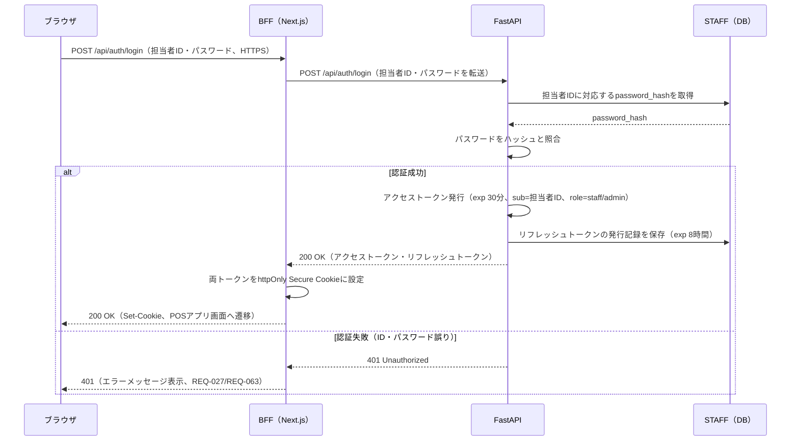

上図はFR-019・BR-001・DR-007・IF-001（確定要件：外部ID基盤不使用の自前認証）を土台に、トークン方式そのものを`[AI提案]`として具体化したものである。

**セッション情報の取得（レビュー指摘事項への対応）**: アクセストークン・リフレッシュトークンをhttpOnly Cookieに格納する設計（上記）を採用すると、その裏返しとして**ブラウザ側のJavaScript（React／Next.jsのクライアントコンポーネント）はトークンの中身を直接参照できなくなる**。一方、SC-02画面は「ログイン中のレジ担当者情報を画面に表示する」（SCR-011、確定要件）ことを求めており、また画面側で「ログイン済みかどうか」を判定してログイン画面とPOSメイン画面を出し分ける必要もある。この2つを両立させるため、`[AI提案]`として `GET /api/session`（6.4.9節）を新設する。BFFはCookieからアクセストークンを取り出してこのAPIを呼び出し、返却された担当者ID・氏名を画面表示用にブラウザへ引き渡す。これにより、トークン自体はブラウザのJavaScriptに一切露出させないまま、画面表示に必要な情報だけを安全に受け渡す。

**ログイン試行回数制限（ロックアウト）**: 総当たり攻撃（ブルートフォース攻撃）対策として、同一`staff_id`で連続5回認証に失敗した場合、当該`staff_id`を15分間ロックする（`[AI提案]`の暫定値。方針自体は確定しているが、具体的な回数・時間は引き続き`[要確認]`）。ロック中に認証を試みた場合は`423 ACCOUNT_LOCKED`（6.4.1節）を返す。実装には5章STAFFテーブルの`failed_login_count`（連続失敗回数）・`locked_until`（ロック解除予定日時）を用いる。認証成功時は`failed_login_count`を0にリセットする。

**アイドルタイムアウト（離席時の自動ロック）**: レジ担当者が端末から離席した際の情報漏えいリスクを軽減するため、一定時間（例：10分、`[AI提案]`の暫定値）操作がない場合、フロントエンド側のタイマーで自動的にログイン画面相当の状態に画面を戻す。BFFが発行するCookieセッション自体（アクセストークン・リフレッシュトークン）は維持し、あくまで画面表示のみを再ログイン待ちの状態に戻す方式を想定する（`[AI提案]`）。これはサーバー側のトークン失効を伴わない画面表示上の制御であり、7.4.1節の認証・認可設計そのものを変更するものではない。

#### 7.4.2 POSレジ機能のセキュリティ対策

本節の対策はすべて要求仕様書に根拠のない `[AI提案]`（推奨事項）であり、Webアプリケーションセキュリティの一般的な考え方（信頼境界の分離、多層防御、攻撃対象領域の縮小）をPOSレジ機能に当てはめたものである。採否は発注者・開発チームの判断による。

**(1) BFF（Backend for Frontend）をリバースプロキシとして構成する方針**

ブラウザはFastAPIへ直接通信せず、必ずNext.js（BFF）を経由させる構成とする。

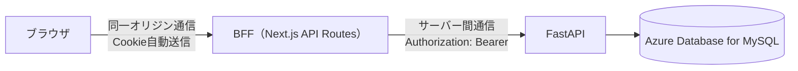

BFFを設ける狙いは次の3点である。

- **トークンの隔離**: 7.4.1のとおり、JWTをブラウザのJavaScriptから隔離し、httpOnly Cookieとして扱うにはCookieの発行元（BFF）とAPIサーバー（FastAPI）が同一ドメイン配下にある必要がある。BFFがその仲介役を担う。
- **攻撃対象領域の縮小**: FastAPIのオリジンをブラウザ・インターネットに直接公開せず、8章のPrivate Link構成と組み合わせてVNet内部限定にできる。ブラウザから見える通信先はBFF（Next.js）だけになる。
- **CORSの単純化**: ブラウザ視点での通信が同一オリジン（BFF）に閉じるため、ブラウザ向けのCORS設定が原則不要になる（詳細は(2)）。

**(2) CORS設定方針**

**訂正**: CORS（Cross-Origin Resource Sharing）は、ブラウザが実装するSame-Origin Policyを、異なるオリジン間の通信で例外的に許可するための「ブラウザ側の仕組み」である。**ブラウザを介さないサーバー間通信（BFFからFastAPIへのfetch等）にはCORSは一切適用されない**。したがって、FastAPI側でCORSMiddlewareをどう設定しても、BFF以外のサーバーやツール（curl等）から直接FastAPIを呼び出す行為を防ぐ効果はない（CORSヘッダーはブラウザ上のJavaScriptからの呼び出しのみに影響する）。以下はこの前提に立って設計方針を訂正したものである。

| 項目 | 設定内容（`[AI提案]`） | 備考 |
|---|---|---|
| ブラウザ ⇔ BFF間 | CORS設定は原則不要 | (1)のとおり同一オリジン通信に閉じるため。ブラウザが関与する唯一の通信経路だが、同一オリジンのためCORSヘッダー自体ほぼ不要 |
| BFF ⇔ FastAPI間 | CORS設定は**意味を持たない**（設定しても防御効果はない） | サーバー間通信のためブラウザのCORS制約を受けない。「BFF以外からの直接アクセスを防ぐ」という目的は、CORSではなく下記の代替手段で実現する |
| BFF以外からの直接アクセス防止の代替手段 | ①8章のネットワーク層分離（Private Link・NSGでFastAPIをVNet内限定にし、外部からの直接到達を物理的に遮断する）②必要に応じて、BFF↔FastAPI間の共有シークレットやmTLS等のアプリケーション層認証を追加する | いずれも要求仕様書に根拠のない `[AI提案]`。②は本書では詳細設計せず、9章の検討課題とする |
| FastAPIの許可メソッド（参考） | GET, POST, OPTIONS | 6章のエンドポイント一覧にPUT/DELETE/PATCHが存在しないため、実装上も未使用メソッドを受け付けないようにする（CORSとは無関係の、リクエストルーティング上の制限） |

なお、Cookie自体はブラウザ⇔BFF間でのみやり取りされ、BFF⇔FastAPI間はJSONボディ・Authorizationヘッダーでの通信であるため、Cookieに関するCORSの`Credentials`設定（`Access-Control-Allow-Credentials`）を意識する必要があるのはブラウザ⇔BFF間のみである。ブラウザ⇔BFF間は同一オリジンのためこの設定自体が不要になる。

**(3) 金額計算の二重検証（改ざん防止）バリデーション設計**

フロントエンド（Next.js）が画面表示のために計算する小計・値引き額・税込税抜合計は、あくまでユーザー体験のためのプレビューであり、正とはしない。購入確定API（`POST /api/transactions`）では、以下の手順でサーバー側の再計算とクライアント計算値の照合を行う。

1. リクエストボディには、商品コード・数量・会員ID・担当者情報に加えて、フロントエンドが計算した参考値（小計・値引き額・税込合計・税抜合計）を含める。
2. FastAPIは、リクエストに含まれる商品コードごとに商品マスタ（PRODUCTS）・値引きマスタ（DISCOUNTS）・税率マスタ（TAX_RATES）を参照し、単価・値引き額・税込税抜合計を**サーバー側で独自に再計算**する。フロントエンドから送信された単価・金額そのものは一切信頼せず、計算の入力には用いない（信頼するのは商品コード・数量・会員IDなどの「事実」のみ）。商品ごとの税区分（`PRODUCTS.tax_category`：標準／軽減）に対応するため、明細行ごとに対象商品の`tax_category`を参照し、`TAX_RATES`から同一`tax_category`で現在有効な税率を取得して適用する。
3. サーバー側の再計算結果と、リクエストに含まれるクライアント参考値を比較する。
4. **一致する場合**：サーバー側の計算値を正としてDBに保存する（クライアント値は保存しない）。
5. **一致しない場合**：「金額不一致エラー」として処理を中断し、409相当のレスポンスを返す（6.3節・6.4節参照）。不一致の原因は悪意ある改ざんとは限らず（例：フロントとバックの実装ズレ、値引き・税率の切り替わりタイミングのレースコンディション等）、一律に不正と断定せず「要再確認」として扱い、原因調査のためログに記録する（`[AI提案]`：監査ログの要否は9章の検討課題とする）。

**値引き再計算の適用範囲についての補足（レビュー指摘事項への対応）**: 上記2.の「サーバー側で独自に再計算する」は、3.2.1節のアクティビティ図で確定した各明細行の値引き適用結果（＝商品登録時点で会員IDが入力済みだった行にのみ値引きが付いている状態）を前提に、その内容が正しいかを検算するものであり、**確定時点の最終的な会員ID状態で全明細行の値引き適用を遡って再判定するものではない**（`[AI提案]`）。会員ID入力前にスキャンした商品への遡及適用を行わないことはISS-006として確定しており（現行設計を維持、発注者確認済み）、本節の再計算ロジックは3.2.1節のアクティビティ図と整合している。

この設計により、ブラウザの開発者ツールやリクエスト改ざんツールでクライアント側の金額計算をどのように書き換えても、DBに保存される金額はサーバー側の再計算値に固定される。

**(4) Swagger／OpenAPI Docsの非公開設定方針**

FastAPIは既定で`/docs`（Swagger UI）・`/redoc`・`/openapi.json`を公開する。これらはAPI構造（エンドポイント・パラメータ・スキーマ）を第三者に開示してしまうため、本番環境では次のいずれかを設定する（`[AI提案]`）。

- FastAPIアプリケーション初期化時に環境変数で分岐し、本番環境では`docs_url=None`, `redoc_url=None`, `openapi_url=None`を指定して エンドポイント自体を無効化する。
- 開発・検証環境（8.1.2節）でのみSwagger UIを有効化し、アクセス制限（Basic認証、IP制限、または8章のPrivate Link経由限定）を追加で設ける。

**(5) SQLインジェクション対策**

| 層 | 対策方針（`[AI提案]`） | 補足 |
|---|---|---|
| フロントエンド（Next.js／TypeScript） | リクエストDTOをTypeScriptの型として定義し、送信前に形式・型を制御する（数量は`number`型、商品コードは`string`型でパターン検証等） | フロントエンド側の型チェックは**利便性向上とネットワーク帯域節約が目的**であり、セキュリティ上の防御境界とはみなさない。ブラウザの開発者ツールやAPI直接呼び出しにより型チェックを迂回できるため、一次防御はバックエンド側に置く（講義で扱ったセキュリティの基本原則：クライアント側検証は信頼しない） |
| バックエンド（FastAPI） | ORM（例：SQLAlchemy等、`[AI提案]`。具体的な製品選定は要件定義書に記載なし）を用いたパラメータバインディングを徹底し、文字列連結による生SQL文の組み立てを禁止する方針をコーディング規約とする | Pydanticモデルによるリクエストの型・値検証と組み合わせることで、不正な入力がSQL実行層に到達する前に弾かれる二重の防御とする |

**(6) 依存パッケージ（フレームワーク・ライブラリ・OSS）の脆弱性管理方針**

要求仕様書には記載がなく、以下は運用上の推奨事項（`[AI提案]`）である。

- フロントエンド（npm/Next.js）・バックエンド（pip/FastAPI）双方について、依存パッケージの既知脆弱性を検出する自動スキャン（例：`npm audit`／`pip-audit`、またはGitHub Dependabot等）を8章のCI/CDパイプラインに組み込み、Pull Request作成時・定期実行の両方でチェックする。
- 脆弱性が検出された依存パッケージのバージョン更新方針として、セキュリティパッチ（パッチバージョン更新）は迅速に反映し、破壊的変更を伴うメジャーバージョン更新は影響範囲を確認した上で計画的に行う、という区別を設ける。
- 具体的なスキャンツール・実行頻度・SLA（検出から対応までの期限）は要求仕様書に根拠がなく確定できないため、9章の検討課題とする。

**(7) 冪等性の確保（二重送信対策）**

購入確定操作（`POST /api/transactions`）は、通信の瞬断やレジ担当者の二重タップ等により、同一の購入内容が複数回送信される可能性がある。これを金額二重計上のまま複数取引として記録してしまうと、実際の売上と乖離するため、冪等性（Idempotency）を確保する設計とする（`[AI提案]`：具体的な実装方式）。

- クライアント（フロントエンド）は、購入確定操作を開始するたびに一意な冪等キー（`idempotency_key`、UUID等を想定）を生成し、リクエストボディに含める（6.4.7節）。同一の購入操作を再送する場合（通信エラー後の自動リトライ等）は、同じ`idempotency_key`を使い回す。
- サーバー（FastAPI）は、リクエストを受信すると、まず`TRANSACTIONS.idempotency_key`（5章、UNIQUE制約）に同一の値が既に存在するかを確認する。
  - **存在しない場合**：通常どおり金額の再計算・照合（(3)節）を行い、新規の取引としてDBへ保存する。
  - **既に存在する場合**：新規の金額計算・DB書き込みは一切行わず、既存の取引結果をそのまま200 OKとして返す（＝二重登録を防止する）。
- この設計により、ネットワーク不調時のクライアント側リトライや、担当者による購入確定ボタンの連打があっても、同一の購入操作が複数の取引として記録されることを防ぐ。UNIQUE制約による排他は、複数リクエストがほぼ同時に到達した場合の競合状態（レースコンディション）に対しても、DB側の一意制約違反という形で安全側に倒れる（後着リクエストはエラーとせず、先に成功した取引結果を返す実装とすることを推奨する、`[AI提案]`）。

**POSレジ購入処理全体のシーケンス図（フロント→BFF→バックエンド）**

3.2.2節（購入確定処理フロー）で示したアクティビティ図に、(1)〜(3)で設計した認証・BFF・金額二重検証の要素を統合したシーケンス図を以下に示す。

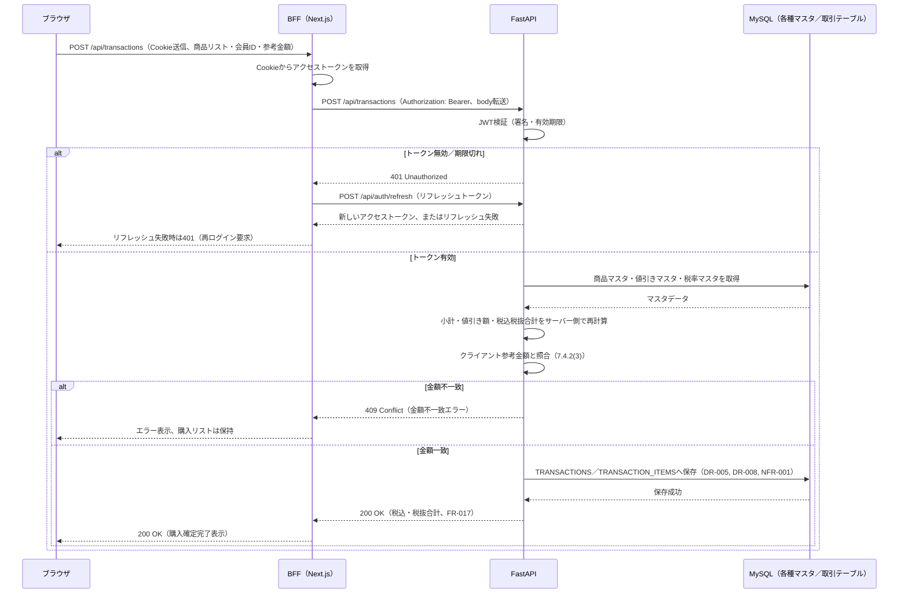

### 7.5 運用・保守要件（NFR-OPS）

| 項目 | 内容 |
|---|---|
| 要件定義書の記載 | 記載なし（`[要確認 ISS-017]`） |
| 設計方針 | ログ設計・監視設計・障害通知の要否等は未定。8章のインフラ構成に伴う一般的なログ収集の可能性のみ触れ、具体的な運用設計は行わない。なお、依存パッケージの脆弱性管理（スキャン・更新方針）は運用保守の一領域だが、セキュリティ対策としての性質が強いため7.4.2(6)節にまとめて記載している |

### 7.6 移行要件（NFR-MIG）

| 項目 | 内容 |
|---|---|
| 要件定義書の記載 | 移行要件自体の記載はないが、Lv1→Lv2の既存データ移行要否（ISS-018）は「新規構築のため移行対象データなし、対応不要」として確定している（14.3節） |
| 設計方針 | Lv1稼働時のデータが存在する前提での移行手順は設計しない。新規構築を前提とする |


---

## 8. インフラ・デプロイ構成

本章の内容は、要求仕様書に明記された確定要件（CON-001〜004：Next.js／FastAPI／Azure／Azure Database for MySQL Flexible Server）を除き、**すべて `[AI提案]` である**。要件定義書には可用性要件（NFR-AVAIL）・運用保守要件（NFR-OPS）・具体的なセキュリティ要件（NFR-SEC）の記載がなく（ISS-015〜017）、参考資料として提示された `ネットワークセキュリティ.pdf`（Tech0提供、Azureの閉域化パターン解説）を根拠に設計者が提案する構成である。採否は発注者・開発チームの判断による。

### 8.1 環境構成

#### 8.1.1 ネットワーク構成（推奨案）

参考資料が示す「閉域化」の考え方（VNet／サブネット分離、NSGによる通信制御、Private Link/Private Endpointによる非公開のPaaS接続、Bastionによる踏み台経由の運用アクセス）を、本システムの構成（Next.js／FastAPI／Azure Database for MySQL）に当てはめた推奨案を示す。図中の「Next.js」は、7.4.2節で設計したBFF（Backend for Frontend）と同一のコンポーネントを指す（呼称が章によって異なるため注記する）。

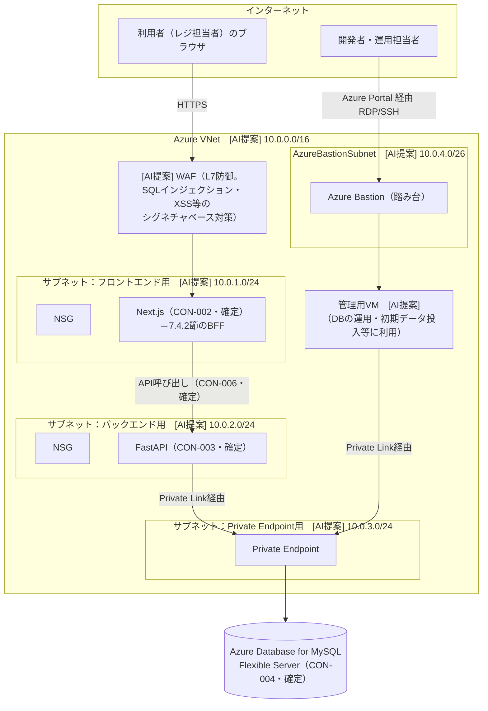

**各要素の位置づけ**（すべて `[AI提案]`。要件定義書に対応する要件はない）:

| 要素 | 役割 | 備考 |
|---|---|---|
| VNet／サブネット分離 | フロントエンド・バックエンド・DB接続用（Private Endpoint）・運用アクセス用をそれぞれ独立したサブネットに配置し、通信範囲を限定する | |
| NSG（ネットワークセキュリティグループ） | 各サブネットのインバウンド／アウトバウンド通信を許可リストで制御する | フロント→バック、バック→DB以外の通信を原則拒否する方針 |
| Private Link／Private Endpoint | Azure Database for MySQLへの接続を、インターネットを経由せずVNet内のプライベートIPで完結させる | DBのパブリックアクセスを無効化することを想定 |
| Azure Bastion（踏み台） | 開発者・運用担当者がDBの初期設定やメンテナンスを行う際、VMにパブリックIPを付与せずAzure Portal経由で安全に接続する | MySQL Workbench等のGUIツールでの直接接続は不可となるため、運用手順は別途検討が必要 |
| WAF（Web Application Firewall） | 「番外編」として参考資料に示された機能。HTTPリクエストを検査しSQLインジェクション・XSS等を防御する | 本システムはユーザー入力（会員ID・商品コード等）を扱うため導入が望ましいと考えられるが、要求仕様書に根拠はなく `[AI提案]` |

**設計上の注意点（`[要確認]` に近い留意事項）**:

- フロントエンド（Next.js）のホスティング先が、VNet統合が可能なサービス（例：Azure App Service、Azure Container Apps）か、VNet外で動作するマネージドサービス（例：Azure Static Web Apps）かによって、上図のようなサブネット内配置が成立するかどうかが変わる。ホスティングサービスの選定自体はTBD-001として開発チームに委ねられているため、本図は「VNet統合を前提とした場合の一案」として示すに留める。
- 決済代行サービス等、外部サービスとの通信は今回のスコープでは対象外として確定している（ISS-003）。仮に将来的なスコープ拡張で対象となった場合は、アウトバウンド通信のためのNAT Gateway／Azure Firewallの追加検討が必要になる。現時点の要件定義書からは外部サービス連携の必要性が確認できないため、本図には含めていない。

#### 8.1.2 環境の種類

要求仕様書には開発環境・本番環境等の環境構成についての記載がない。一般的なWebアプリケーション開発の慣行に基づき、以下を `[AI提案]` として示す。

| 環境 | 用途 | 備考 |
|---|---|---|
| 本番環境 | 実際のレジ業務で使用する環境 | 要件定義書が前提とする稼働環境 |
| 開発／検証環境 | 開発中の動作確認、要確認事項の解消後の再設計検証等に使用 | `[AI提案]`。要否・構成は要確認 |

---

### 8.2 CI/CD概要

要求仕様書にCI/CDに関する記載はなく、本節は全体を通じて `[AI提案]` である。

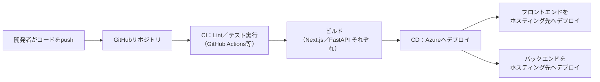

- ビルド・デプロイ対象がフロントエンド（Next.js）・バックエンド（FastAPI）で分かれるため、CI/CDパイプラインもそれぞれ独立させる構成を想定する。
- データベースのスキーマ変更（マイグレーション）を伴う変更については、5章のテーブル定義書の変更とあわせてマイグレーションスクリプトを管理する運用を想定するが、詳細な運用ルールは本書のスコープ外とする。
- 具体的なCI/CDツール・パイプライン定義・デプロイ承認フロー等は、要求仕様書に根拠がないため確定要件とはせず、9章の検討課題として持ち越す。


---

## 9. 未決事項・今後の検討課題

### 9.1 要件定義書の未確定事項が設計に与えた影響

要件定義書14章で起票された `ISS-xxx`（未確定事項・要確認事項）のうち、本設計書の作成に影響したものを再掲し、各章でどのように暫定処理したかを整理する。ここに記載した暫定処理は、いずれもISS自体を解消するものではなく、**ISSが解消されるまでの間、設計を先に進めるための仮の扱いに過ぎない**。ISSが解消された時点で、該当する設計章は見直しが必要になる。

| ISS-ID | 種別 | 優先度目安 | 未確定事項 | 設計への影響・暫定的な扱い | 関連章 |
|---|---|---|---|---|---|
| ISS-002 | B | 中 | Lv2独自要素の画面イメージがない | 画面レイアウトを確定図とせず、`[AI提案]`のワイヤーフレーム案に留めた | 4章 |
| ISS-009 | B | 中 | バーコードスキャン失敗時の挙動 | アクティビティ図では商品マスタ未登録エラー（確定要件）のみ分岐に含め、スキャン失敗自体は注記に留めた | 3.2.1節 |
| ISS-016 | B | 低 | セキュリティ要件の具体的水準 | パスワードハッシュ化・HTTPS前提という方向性のみ示し、具体的な暗号方式・鍵管理は設計していない | 7.4節 |
| ISS-019 | A | 中 | 「DB接続をある程度維持」の具体化 | コネクションプーリングの利用という方向性のみ示し、具体的なプールサイズ等は設計していない | 7.2節 |

ISS-014（性能数値目標）、ISS-015（可用性要件）、ISS-017（運用保守要件）は、本書では特段の暫定処理を行わず、要件定義書の記載どおり「未定」として扱った（該当する章では設計を行っていない、または言及していない）。

ISS-027（担当者情報・会員ID表示要素の継続、**解消済み**）は、要件定義書上すでに解消済みの事項であるため、4章の画面項目定義に確定要件として反映済みである。

#### 解消済みのISS（参考）

以下のISSは発注者との確認により解消済みであり、決定内容は本設計書の該当章に反映済みである。決定に至る経緯・審議過程の詳細はここでは扱わず、決定内容のみを一覧化する。

| ISS-ID | 決定内容（一言） | 反映章 |
|---|---|---|
| ISS-005 | 管理者ロール（admin、BR-005）限定の値引き・税率管理機能（4章SC-04、6章API）を新設 | 3, 4, 5, 6, 7章 |
| ISS-006 | 会員ID入力前にスキャンした商品への値引き遡及適用は行わない（現行設計を維持） | 3.2.1, 7.4.2(3)節 |
| ISS-007 | 1商品1値引きのみとし、重複登録を禁止 | 5章 |
| ISS-008 | 存在しない会員IDはエラー（404 MEMBER_NOT_FOUND）として入力を拒否 | 6章 |
| ISS-010 | ログアウト機能をスコープ内・実装対象とする | 6, 7.4.1節 |
| ISS-012 | 軽減税率対応をスコープ内とし、商品ごとの税区分（tax_category）で管理 | 5, 6, 7章 |
| ISS-013 | レジ業務の役割定義はBR-001〜005で具体化済みとし、追加定義は不要 | ―（追加の設計変更なし） |
| ISS-024 | 手入力フローは名称・単価の一時表示＋追加ボタンの2段階を継続 | 4.2.2節 |
| ISS-025 | 購入確定後は購入リスト・会員ID・コード入力欄を全てクリア | 3.2.2, 4.2.2節 |
| ISS-026 | 「お客様ID読み込みボタン」を専用ボタンとして設置 | 4.2.2節 |
| ISS-028 | ポップアップで税込・税抜合計金額を両方表示 | 4.2.2, 6章 |
| ISS-029 | 確定操作はEnterキーのみとし、専用ボタンは設けない | 4.2.2節 |
| ISS-030 | 商品コードは8〜13桁（JAN／EAN想定） | 5章 |

これに伴い、要件定義書側の「14. 未確定事項・要確認事項」も該当箇所が「解消」に更新されている（`output/requirements-definition/07_要件定義書.md`側の更新済み。同書ではBR-005・FR-025が新設され、ISS-005が解消と記載されている）。

#### 対象外として確定したISS（参考）

以下のISSは、「小規模スーパー向けの学習用簡易POSアプリ」というスコープ（ASM-003）を踏まえ、発注者確認のうえ対象範囲外として確定した事項である（要件定義書14.3節）。該当する機能一覧・画面一覧・APIエンドポイント一覧のいずれにも含めていない。

| ISS-ID | 内容 | 対象外の理由 |
|---|---|---|
| ISS-003 | 会計・精算の中身（支払い手段／レシート／返品／取消） | スコープ外として確定 |
| ISS-004 | 商品マスタの新規登録・編集機能 | スコープ外として確定 |
| ISS-011 | 複数レジ端末の同時稼働 | スコープ外として確定 |
| ISS-018 | Lv1→Lv2の既存データ移行 | 新規構築のため移行対象データなし、対応不要と確定 |
| ISS-020 | 在庫管理機能 | スコープ外として確定 |
| ISS-021 | 生鮮食品対応 | スコープ外として確定 |
| ISS-022 | 会員登録機能 | スコープ外として確定（会員情報は登録済み前提、ASM-001） |

### 9.2 本設計書の作成過程で新たに生じた検討課題

要件定義書の時点では存在しなかったが、設計を具体化する過程で新たに判断が必要になった論点を、`D-ISS-xx` として記録する。

| D-ISS-ID | 論点 | 関連章 |
|---|---|---|
| D-ISS-01 | バックエンド（FastAPI）の最終的なホスティングサービス選定（TBD-001は要件定義書段階の未決事項であり、開発チームでの決定が必要） | 2.1, 8.1節 |
| D-ISS-02 | 購入リスト（確定前の一時データ、DR-002相当）をフロントエンド・バックエンドのどちらが保持するか、CON-006の役割分担をどう具体化するか。**解消済み**：フロントエンド（Next.js、ブラウザの状態管理）側で保持することに確定 | 5.1, 5.3, 6章 |
| D-ISS-03 | パスワードのハッシュ化アルゴリズム・鍵管理方式の確定 | 5.2, 7.4節 |
| D-ISS-04 | 8章で提示したAzure閉域化構成（VNet分離・NSG・Private Link・Bastion・WAF）の採否、および採用する場合のフロントエンドホスティング方式（VNet統合可能なサービスの選定） | 8.1節 |
| D-ISS-05 | MEMBERSテーブルで「年齢」を直接保持する設計（要求仕様書の記載どおり）が運用上妥当か（生年月日保持＋都度計算との比較） | 5.2節 |
| D-ISS-06 | CI/CDツール・パイプライン定義・デプロイ承認フローの確定 | 8.2節 |
| D-ISS-07 | DISCOUNTSテーブルの「1商品1値引き」という単純化の妥当性。**解消済み**：見直し不要と確定（1商品1値引き・重複登録禁止で確定） | 5.2節 |
| D-ISS-08 | リフレッシュトークンの発行記録・失効管理用テーブル（REFRESH_TOKENS等）を5章のデータ設計に追加するかどうか、追加する場合のテーブル構造。**解消済み**：`REFRESH_TOKENS`テーブルを追加することに確定（5章参照） | 5.1, 5.2, 6.4, 7.4.1節 |
| D-ISS-09 | レジ担当者の権限区分（ロール分け）の要否。**解消済み**：管理者（admin）・一般（staff）の2ロールを新設（BR-005）。詳細は5章STAFF.role列、7章7.4.1節、6章F-10 APIを参照 | 7.4.1節 |
| D-ISS-10 | JWTアクセストークン（30分）・リフレッシュトークン（8時間）の有効期限の妥当性。実際のレジ運用（シフト長・休憩の取り方等）に照らした見直しの要否 | 6.2, 7.4.1節 |
| D-ISS-11 | 金額不一致エラー（7.4.2(3)節）発生時の監査ログ・アラート通知の要否、および不一致発生時の運用対応フロー | 7.4.2節 |
| D-ISS-12 | 依存パッケージ脆弱性スキャンの具体的なツール・実行頻度・検出から対応までのSLA | 7.4.2(6)節 |
| D-ISS-13 | Swagger／OpenAPI Docsを開発環境でのみ有効化する際の環境切り替え方式（環境変数管理・アクセス制限の具体的な実装方式） | 7.4.2(4)節 |
| D-ISS-14 | STAFF（レジ担当者）アカウント発行手段の要否。**解消済み**：簡易登録API（`POST /api/staff`）・簡易登録画面（SC-03）を追加（権限チェックの詳細は詳細設計で検討） | 3, 4, 5, 6章 |
| D-ISS-15 | discount_type='amount'の値引き額の単位（商品1個あたりか、明細行全体か）。**解消済み**：商品1個あたりの金額とし、明細行の値引き合計は`discount_value × quantity`で計算 | 3, 5章 |
| D-ISS-16 | 数量上限（99）到達時の再スキャン・追加操作の挙動。**解消済み**：エラー表示（`QUANTITY_LIMIT_EXCEEDED`）で拒否し、数量は99のまま維持 | 3, 6章 |
| D-ISS-17 | 購入確定APIの二重送信対策の要否。**解消済み**：クライアント生成の冪等キー（`idempotency_key`）を必須パラメータとし、同一キーでの再送時は既存の取引結果をそのまま返す | 5, 6, 7.4.2節 |
| D-ISS-18 | ログイン試行回数制限（ロックアウト）の要否。**解消済み**：同一staff_idで連続5回認証失敗した場合、15分間ロックする方針（`[AI提案]`の暫定値。具体的な回数・時間は引き続き`[要確認]`） | 5, 6, 7.4.1節 |
| D-ISS-19 | 金額不一致（AMOUNT_MISMATCH）発生時の担当者向け案内文言。**解消済み**：「金額が一致しませんでした。もう一度商品をご確認のうえお試しください（商品の価格や値引き内容が変更された可能性があります）」に確定 | 6章 |
| D-ISS-20 | アイドルタイムアウト（離席時の自動ロック）の要否。**解消済み**：一定時間（例：10分、`[AI提案]`の暫定値）操作がない場合、画面表示をログイン相当の状態に戻す（BFFのCookieセッション自体は維持） | 6, 7.4.1節 |
| D-ISS-21 | BFF（Next.js API Routes）とFastAPIエンドポイントの対応関係の明文化要否。**解消済み**：BFFは各FastAPIエンドポイントと同一のパス・メソッドでブラウザに公開し、内部でFastAPIの同名エンドポイントへプロキシする方針（`[AI提案]`） | 6.1節 |

これらの検討課題は、要件定義書のISS一覧と同様に、発注者・開発チームでの確認・決定を経るまでは未確定のままとする。本書自体も、これらの解消に伴って改訂されることを前提とした「第1版（ドラフト）」である。D-ISS-02, D-ISS-07〜09, D-ISS-14〜21はいずれも解消済みであり、決定内容は上表に記載のとおりである。


---
